# Capítulo 1: Configuración inicial de ABAP Cloud en Eclipse ☁️💻

Bienvenido a este viaje por **ABAP Cloud con Eclipse**.  
En este capítulo vamos a **explorar juntos** cómo crear tu cuenta trial gratuita, configurar Eclipse con **ABAP Development Tools (ADT)** y dejar todo listo para tus primeros proyectos.

> Lo mejor: ¡esta cuenta será completamente gratis! 🆓

---

## 💻 Paso 1: Preparar Eclipse

1️⃣ **Instalar Eclipse**

- Asegúrate de tener Eclipse instalado en tu computadora.
- Puedes descargarlo desde [Eclipse Downloads](https://www.eclipse.org/downloads/).
- “Instala la versión más reciente de Eclipse IDE (o al menos una versión de Eclipse compatible con ADT, idealmente 2024‑xx o posterior) y asegúrate de que Java sea 11 o superior.”

2️⃣ **Agregar los plugins de ABAP**

Para poder desarrollar en ABAP dentro de Eclipse, necesitamos instalar los **ABAP Development Tools (ADT)**. Estos plugins permiten que Eclipse se comunique con tu sistema ABAP Cloud o SAP BTP y te proporcionan todas las herramientas de desarrollo (editores de código, explorador de objetos, ejecución de clases, depuración, etc.).

Pasos:

1. En Eclipse, ve a `Help → Install New Software…`.

2. En el campo **Work with**, pega la URL de los plugins oficiales:  
   `https://tools.hana.ondemand.com/latest/` 🌐
   > Esta URL siempre apunta a la versión más reciente compatible de ADT. Usar la última versión garantiza que tendrás todas las funcionalidades y soporte para ABAP Cloud.

3. Selecciona la opción **ABAP Development Tools (ADT)** ✅
   > Esto instalará todos los componentes necesarios: editores de clase, explorador de objetos, asistentes para crear paquetes, transportes y mucho más.

4. Haz clic en `Next → Finish`. Acepta las licencias y confirma que confías en el plugin cuando Eclipse lo pregunte ✔️
   > Eclipse necesita tu permiso para instalar software de terceros y asegurarse de que confías en el origen del plugin.

5. Espera a que se complete la instalación. Esto puede tardar unos minutos dependiendo de tu conexión.

6. Finalmente, haz clic en **Restart Now** 🔄
   > Eclipse se reiniciará para aplicar los cambios y cargar los nuevos plugins de ABAP. Después del reinicio, tu IDE estará listo para crear proyectos y conectarse a ABAP Cloud.

💡 **Tip:** Si al reiniciar no aparece la perspectiva ABAP (la ventana de trabajo específica de ADT), revisa que hayas instalado correctamente todos los componentes del plugin y que tu Eclipse sea compatible con ADT (ver paso 1 sobre versión de Eclipse y Java).

3️⃣ **Abrir la perspectiva ABAP**

- Ve a `Window → Perspective → Other → ABAP`

- ¡Listo! Eclipse ahora está preparado para trabajar con ABAP 🚀

---

## 🌐 Paso 2: Crear tu cuenta SAP

Para poder trabajar con ABAP Cloud y conectar Eclipse, primero necesitamos una **cuenta SAP**. Esto nos permitirá acceder a la **SAP Business Technology Platform (BTP)** y crear nuestros ambientes de desarrollo.

1️⃣ **Registrarte en SAP**

- Ve a [SAP](https://www.sap.com/index.html).
  > Esta es la página oficial de SAP, donde se gestionan todas las cuentas y servicios en la nube. Pinchas en el icono del muñeco de la imagen para acceder a crear tu cuenta.

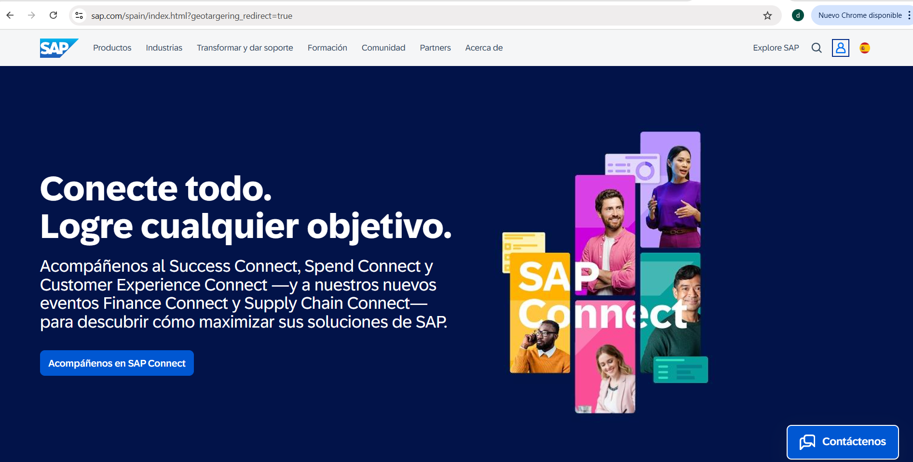

- Si ya tienes cuenta, simplemente inicia sesión con tus credenciales.
- Si no tienes cuenta, haz clic en **“Cree su cuenta de SAP”** ✍️.
  > Al crear tu cuenta, SAP garantiza que tendrás acceso a servicios de prueba y a la plataforma BTP para desarrollo y aprendizaje.

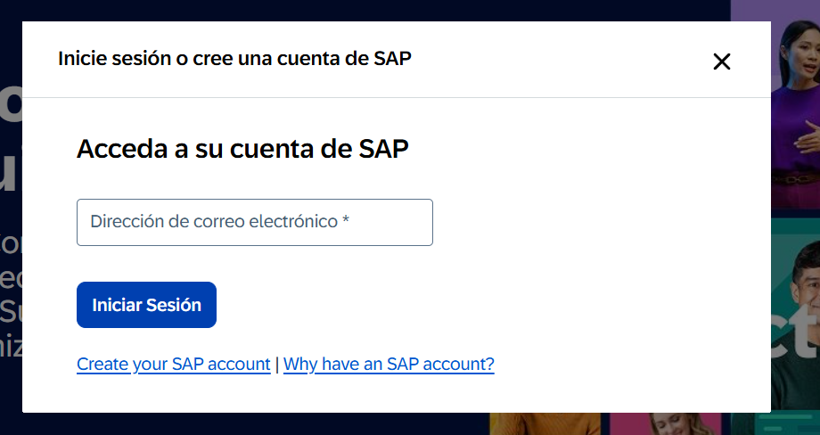

- Ingresa tus datos personales (nombre, correo electrónico, contraseña, país, etc.) y acepta los términos y condiciones.
- Verifica tu correo electrónico 📧 siguiendo el enlace que SAP enviará a tu bandeja de entrada.
  > Este paso confirma que tu dirección de correo es válida y activa tu cuenta SAP.

2️⃣ **Configurar tu cuenta ABAP Cloud**

Una vez creada tu cuenta SAP, el siguiente paso es configurar tu **entorno ABAP Cloud** dentro de la **SAP Business Technology Platform (BTP)**. Esto nos permitirá **crear proyectos, clases y objetos ABAP directamente en la nube**.

- Primero, asegúrate de tener una cuenta **BTP (SAP Business Technology Platform)**.

  > La BTP es la plataforma en la nube de SAP donde se alojan los servicios de desarrollo, incluyendo ABAP Cloud, HANA, Fiori y otros.

- Ingresa en el enlace [SAP-BTP](https://account.hanatrial.ondemand.com/) 🌐.

  > Este enlace te llevará directamente a la sección de trial de BTP para desarrolladores.

- Verifica tu correo electrónico y número de teléfono 📱 si es la primera vez que accedes.

  > La verificación asegura que tu cuenta es válida y te permite recibir notificaciones importantes sobre la cuenta y servicios.

- Acepta los términos legales y selecciona **US → Create Account**.

  > Esto creará tu **instancia trial** en la región de Estados Unidos. La región puede ser importante para el rendimiento y compatibilidad del entorno.

- ¡Perfecto! ✅ Tu **cuenta trial de ABAP Cloud** ya está activa. Ahora podrás conectarla con Eclipse y empezar a crear tus proyectos ABAP directamente en la nube.

  > Ten en cuenta que esta cuenta tiene una duración limitada de **30 días**, ampliable hasta **90 días**.  
  > Si necesitas más tiempo, siempre puedes crear una nueva cuenta trial y disponer nuevamente de un periodo inicial de 30 días, prorrogable hasta 90 días.

  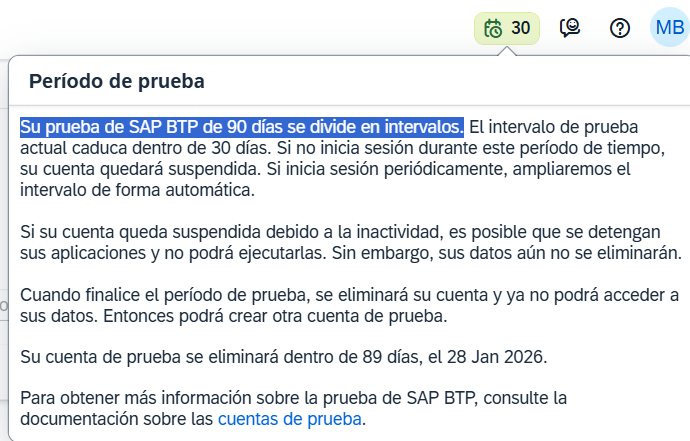

- Todo lo que hagas puede **resguardarse y respaldarse** 💾, permitiéndote mantener tus desarrollos y reutilizarlos si decides crear otra cuenta en el futuro.

---

## ⚡ Paso 3: Crear y conectar tu ambiente ABAP en Eclipse

1️⃣ **Crear una instancia ABAP en BTP mediante Boosters**

- Ingresa a tu cuenta de **SAP BTP** y dirígete a la sección **Boosters**.

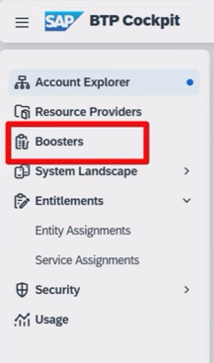

- Busca la opción **ABAP** y haz clic en `Start` ⏳ para iniciar la creación de tu instancia.

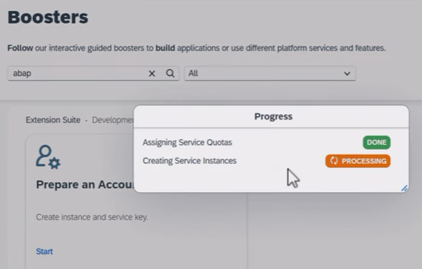

- Durante este proceso, BTP configurará automáticamente tu entorno de desarrollo en la nube.
- Una vez completada la creación, navega a **Subcuentas** para gestionar tu nueva instancia y acceder a las claves de servicio.

2️⃣ **Conectar tu instancia con Eclipse**

- Dentro de BTP, ve a **Instancias y suscripciones → Service Key → View**.

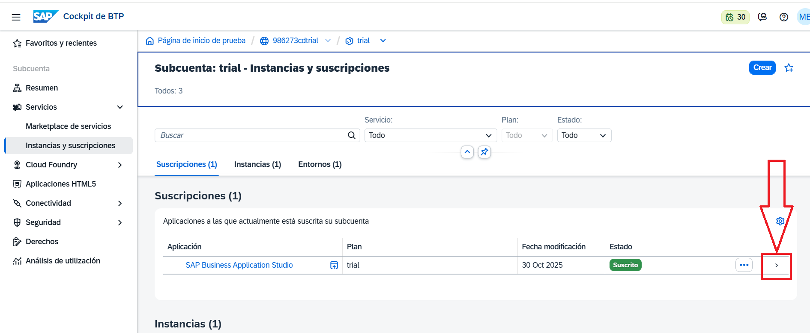

- Copia la **URL de conexión** o descarga el archivo **JSON** que contiene la información de la instancia. Para ello pulsa en instancias y le damos click a la flecha de la derecha.

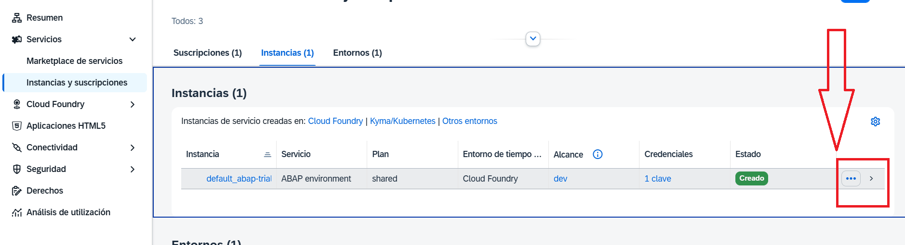

- En el desplegable que sale en la derecha, le damos click a claves de servicios.

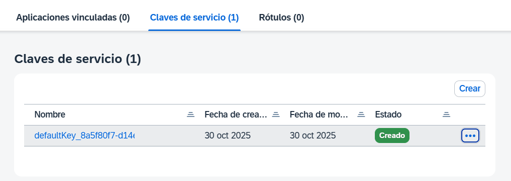

- Le damos a los 3 puntitos. Yo aconsejo que descargues el json, sino quieres copia la url, es suficiente.

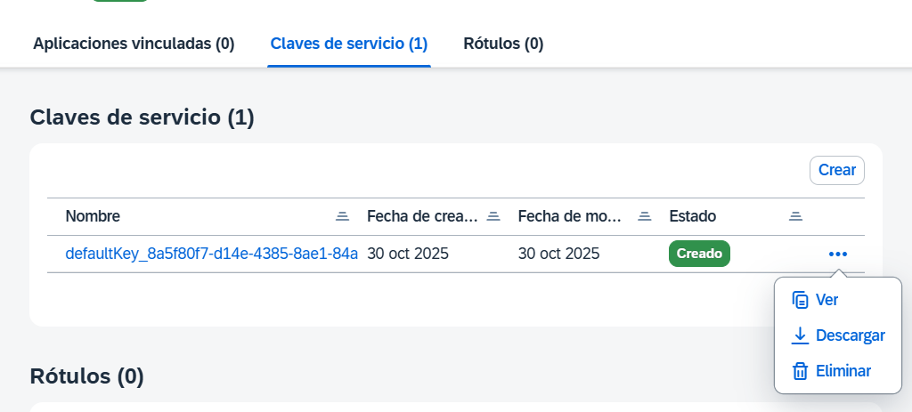

- Le das ver y copia la primera linea. Necesitamos esa url para conectarlo con nuestro eclipse.

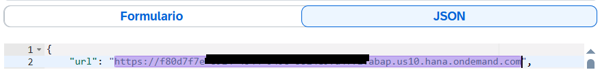

- En Eclipse, selecciona: `Nuevo proyecto → Proyecto de Cloud`.

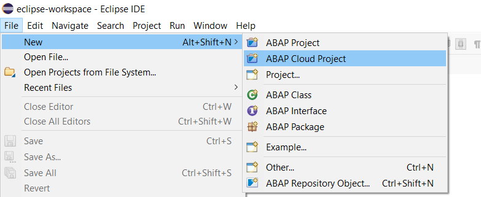

- Pega la URL que copiamos desde el SAP BTP.

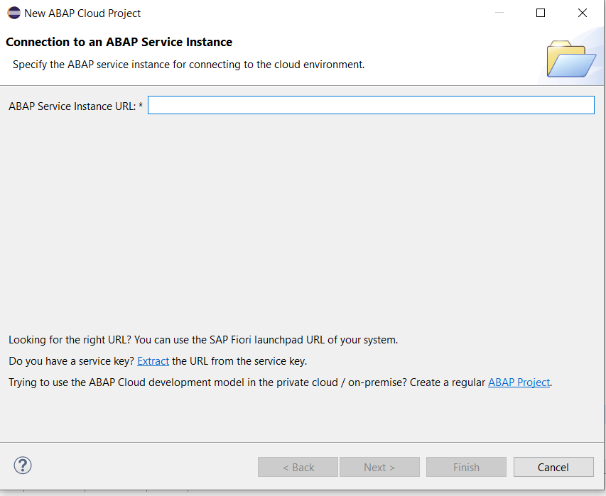

- Si no ves la opción de conectar, asegúrate de haber actualizado los **plugins ABAP Development Tools (ADT)** como se indicó en el Paso 1.
- Inicia sesión con tus credenciales de SAP cuando Eclipse lo solicite para completar la autenticación.

3️⃣ **Finalizar la conexión y verificar**

- Haz clic en **Finish** ✅ para completar la configuración.

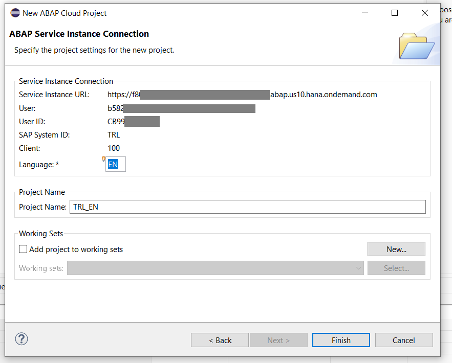

- Tu ambiente ABAP ahora está conectado y listo para trabajar.
- Podrás **crear paquetes, clases, interfaces, tablas y otros objetos ABAP** directamente desde Eclipse 💻.
- Tip: Mantén a mano la **Service Key**; si necesitas reconectar desde otra máquina o restaurar la instancia, podrás reutilizarla fácilmente 🔄.

---

✅ **Resultado final**  
Ahora tienes:

- Eclipse configurado con ABAP 🚀
- Tu cuenta BTP gratuita
- Un ambiente ABAP Cloud conectado y listo para empezar

> En los próximos capítulos aprenderemos a **crear paquetes, clases y programar ABAP paso a paso** 🏆
