# 🚀 Capítulo 2: ¡Hola Mundo! Soy ABAP 🌍

| [⬅️ Ir al Capítulo 1](../docs/01-Introduccion.md) | [↩️ Volver al inicio del proyecto](../README.md) |
| :-----------------------------------------------: | :----------------------------------------------: |

---

En este capítulo vamos a dar nuestros primeros pasos reales en ABAP Cloud. Después de haber instalado Eclipse y conectado nuestro entorno en SAP BTP, ahora aprenderemos a entender el entorno de trabajo (el famoso Project Explorer) y crearemos nuestro primer programa ABAP: “¡Hola Mundo! Soy ABAP”.

---

## 🧭 Explorando Eclipse y el Project Explorer

Antes de programar nada, veamos qué tenemos en pantalla cuando abrimos nuestro entorno ABAP en Eclipse. Después de haber configurado todo en el Capítulo 1, ahora deberías ver algo así en el panel izquierdo 👇


- 🧩 **¿Qué es todo esto?**

Cuando conectas tu Eclipse con tu cuenta SAP BTP ABAP Cloud trial, SAP automáticamente crea una conexión al sistema TRL (Trial). No te preocupes, tú no creaste nada manualmente: esto viene preconfigurado para que puedas empezar a practicar sin tocar objetos del sistema.

| **Elemento**                            | **Qué es**                               | **Lo creaste tú** | **Para qué sirve**                                                     |
| :-------------------------------------- | :--------------------------------------- | :---------------: | :--------------------------------------------------------------------- |
| **TRL_EN [TRL, 100, CB9980002564, EN]** | Tu conexión activa a **ABAP Cloud**      |       ❌ No       | Es tu entorno Cloud, conectado con **SAP BTP**.                        |
| **Favorite Packages (42629)**           | Todos los **paquetes del sistema**       |       ❌ No       | Contiene el **código base estándar** de SAP.                           |
| **Favorite Objects (0)**                | Tu **lista personal de favoritos**       | ⚙️ Tú los añades  | Permite tener **acceso rápido** a tus programas y clases.              |
| **Released Objects (6309)**             | Objetos públicos **“liberados” por SAP** |       ❌ No       | Son las **APIs disponibles** que puedes usar libremente en ABAP Cloud. |

> 💡 Dato curioso: En ABAP Cloud solo puedes usar objetos liberados. Esto garantiza que todo tu código sea compatible con el entorno cloud y no dependa de funciones internas del sistema.

---

## 📦 Paquetes y estructura del entorno

En ABAP clásico (ECC), trabajábamos con transacciones como SE80 o SE38.
Pero en ABAP Cloud ya no existen esas transacciones — ahora todo se maneja como objetos dentro de Eclipse 🧱.

Los paquetes 📦 funcionan como carpetas organizadoras de tus programas, clases e interfaces.

Cuando recién comienzas, puedes crear tus desarrollos en el paquete temporal $TMP, que no requiere transporte ni autorización especial.

Más adelante aprenderemos a crear paquetes persistentes y transportables para proyectos reales.

---

## 📦 Crear tu propio paquete ABAP

En Eclipse, abre el panel izquierdo Project Explorer.

    Ahí verás tu conexión, algo como:

    TRL_EN [TRL, 100, tu numero id user trial, EN]

Expándelo (haz clic en el ▶️).

Dentro, abre la carpeta Favorite Packages.


Sobre ZLOCAL haz click derecho:
New → ABAP Package.


Te pedirá algunos datos:

**Name**: yo le voy a poner Z + mi primer apellido + \_TUTORIAL = ZBREA_TUTORIAL

**Description**: “Paquete para mi primer programa ABAP”.

Marcamos el checkbox de "add to favorite packages" Le damos a Next


**¿Por qué no puedes seleccionar Software Component ni Transport Layer?**

ABAP Cloud Trial no funciona igual que un sistema on-premise (ECC/S4).

Cuando creas un paquete en ZLOCAL: Eclipse ya sabe en qué Software Component vas a trabajar. Por eso, el campo de Software Component aparece en gris y no se puede cambiar.

Lo mismo pasa con Transport Layer:En Trial, no existen transportes reales. Eclipse muestra el campo, pero no se puede editar.


**Select Transport Request aparece en blanco**

En sistemas productivos, aquí seleccionarías un transport request existente o crearías uno nuevo. En ABAP Cloud Trial, no hay transport requests disponibles.

Esto es esperado: simplemente Eclipse te obliga a pasar por esta pantalla, pero puedes darle Finish directamente.


Finalmente ya tenemos el paquete creado, y listo para crear nuestros programas.


---

## 🚚 Cómo abrir el Transport Organizer

> ⚠️ Nota importante: En ABAP Cloud no es necesario usar transportes reales como en ECC/S4HANA, porque todos tus objetos se guardan directamente en el sistema cloud trial.

> Entonces, ¿por qué aparece Transport Organizer y por qué Eclipse nos pide un Transport Request?

> Es **solo una forma de simular el flujo de trabajo de un sistema productivo** y de **organizar tus cambios**. Nos permite aprender buenas prácticas, mantener ordenados los objetos y familiarizarnos con cómo funcionaría en un entorno real.

En Eclipse, ve a `Window → Show View → Transport Organizer` sino te sale directamente en show view debes darle a other y buscar Transport Organizer.

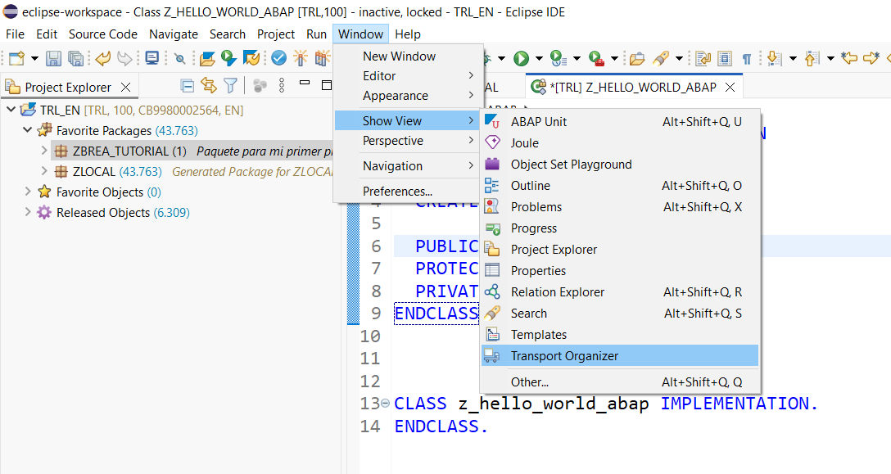

Ahora aparecerá una ventana lateral donde puedes ver:


- **Transport Requests** (solicitudes de transporte)
- **Objetos** que has creado o modificado
- **Estado de liberación**

Aunque ABAP Cloud no usa transportes tradicionales, necesitas asociar tus objetos a un **“transport” interno** para poder guardarlos y ejecutar cambios.

Por ejemplo, cuando creas tu clase `Z_HELLO_WORLD_ABAP`, Eclipse te pide **Transport Request** aunque solo sea local.

Aquí puedes **asignar, revisar y liberar tu objeto, crear transportes, quitar transportes, añadir objetos y visualizar el estado de cada uno** antes de ejecutarlo.

💡 **Tip curioso:** Esto simula la experiencia de ECC/S4HANA, y es útil para **controlar tus cambios** y aprender a manejar transportes antes de trabajar en un sistema productivo.

---

## 💻 Crear programa ABAP “Hola Mundo”

Ahora ya estamos preparado para crear nuestro primer programa dentro de **ZBREA_TUTORIAL**:

Clic derecho sobre ZBREA_TUTORIAL → New → ABAP Class

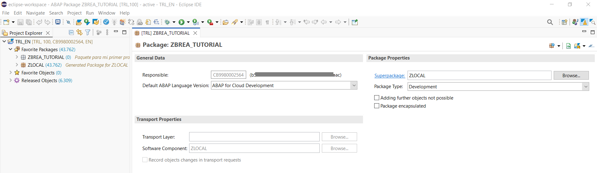

Nombre del programa: Z_HELLO_WORLD_ABAP
Descripción: “Mi primer programa ABAP”
Le damos al boton add Interfaces y agregamos esta interfaz: IF_OO_ADT_CLASSRUN


Le damos a next para continuar


En transport Request lo dejamos en blanco y le damos a finish

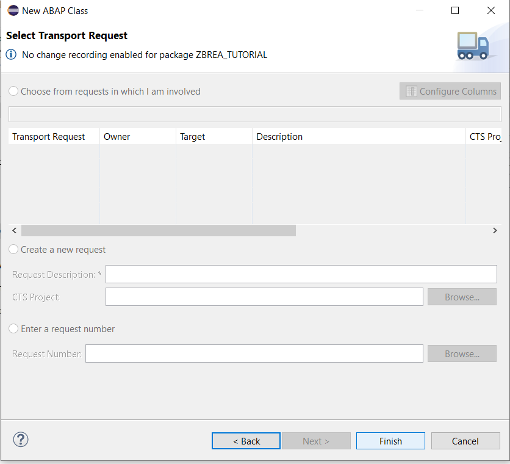

¡Tachaaan! ✨ Eclipse abrirá el editor de código 🖥️

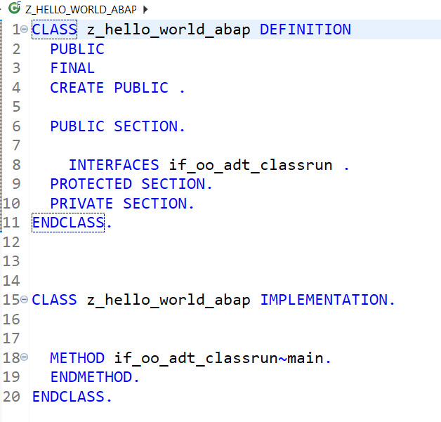

---

## Explicación del código que se generó al crear la clase

```abap
CLASS z_hello_world_abap DEFINITION
  PUBLIC
  FINAL
  CREATE PUBLIC .

  PUBLIC SECTION.
  PROTECTED SECTION.
  PRIVATE SECTION.
ENDCLASS.
```

> CLASS z_hello_world_abap DEFINITION


Aquí defines la estructura de la clase.
z_hello_world_abap es el nombre de tu clase.

En ABAP Cloud, todas las clases se crean como objetos, no como programas.

> Modificadores

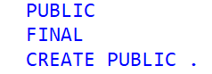

PUBLIC → la clase es accesible desde otros objetos o programas.
FINAL → la clase no puede ser heredada.
CREATE PUBLIC → puedes crear instancias de esta clase desde cualquier lugar.

> Secciones de la clase

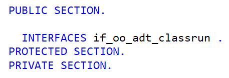

| **Sección**            | **Accesible por**    | **Uso típico**                           |
| :--------------------- | :------------------- | :--------------------------------------- |
| **PUBLIC SECTION.**    | Todos los objetos    | Métodos o atributos que quieres exponer. |
| **PROTECTED SECTION.** | Subclases            | Elementos que pueden heredarse.          |
| **PRIVATE SECTION.**   | Solo la propia clase | Variables o métodos internos.            |

> Dentro de la PUBLIC SECTION

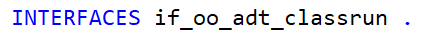

Esto es muy importante 👉 esta interfaz permite que tu clase se pueda ejecutar desde Eclipse. Equivale al método main() en otros lenguajes como Java o C.
Sin esta interfaz, tu clase no se podría correr como una aplicación ABAP Cloud.

> CLASS z_hello_world_abap IMPLEMENTATION.

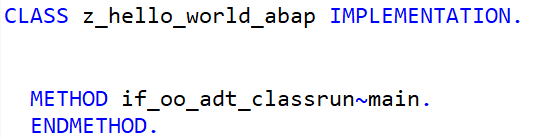

Aquí es donde escribes la implementación real de los métodos que declares en la sección pública, protegida o privada.

Aquí es donde va el comportamiento (lo que hace tu clase).
El método if_oo_adt_classrun~main se ejecuta automáticamente cuando pulsas
▶️ “Run → Run As → ABAP Application (Console)”.

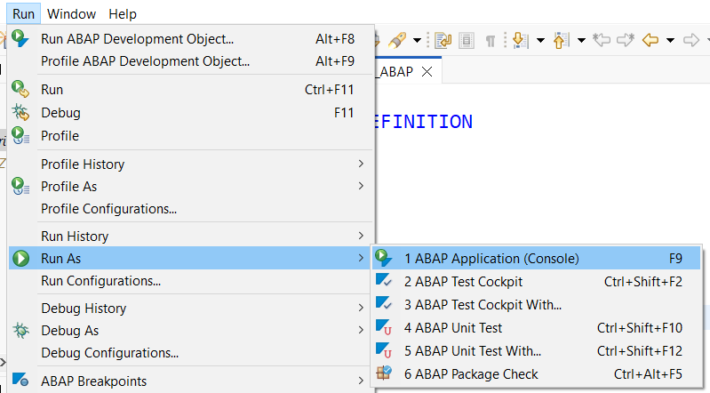

---

> 💡 **¡Dato curioso!** En ABAP, cada sentencia se termina con un punto (.). Esto es diferente a otros lenguajes como Java, C o Python que usan punto y coma o indentación. Si olvidas el punto, ABAP no ejecutará tu código y te marcará error.

---

## 🖐️ Creando nuestro “Hola Mundo” en ABAP Cloud

⚠️ En **ABAP Cloud** ya no vamos a crear **programas ejecutables** ni **transacciones**. Ahora todo trabaja **orientado a objetos** y todo se ejecuta mediante **clases y métodos**

La interfaz que usamos (`IF_OO_ADT_CLASSRUN`) nos indica **cómo se ejecuta el código** y dentro de su método principal (`MAIN`), va todo lo que queremos ejecutar. También podemos crear otros métodos y llamarlos desde ahí.

---

### 💬 Escribiendo el código del “Hola Mundo”

Dentro del método `MAIN`, vamos a imprimir nuestro mensaje.  
Escribe el siguiente código 👇

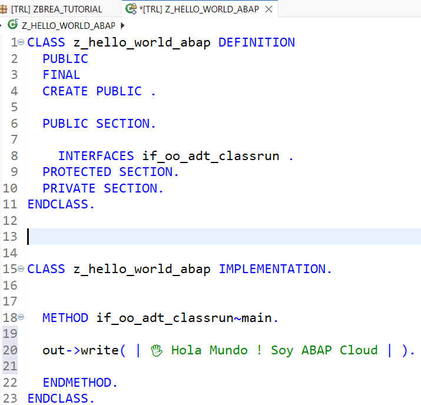

📌 Este método MAIN sería como nuestro antiguo **START-OF-SELECTION** en los programas tradicionales de ABAP.

Para ejecutar el programa, primero activamos en este icono (una especie de cerilla):

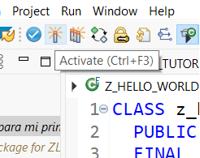

Luego ejecuta con F9 o clic derecho → Run As → ABAP Application (Console)

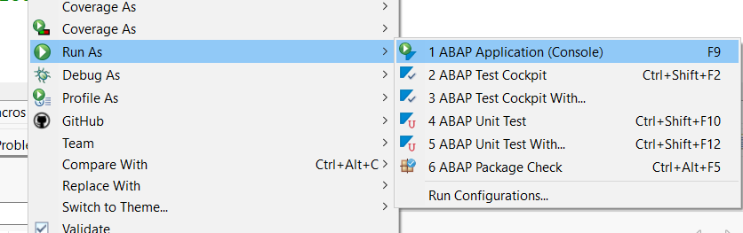

🎉 ¡Y aquí lo tienes!

Tu consola mostrará:

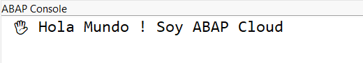


---

| [⬅️ Ir al Capítulo 1](../docs/01-Introduccion.md) | [↩️ Volver al inicio del proyecto](../README.md) |
| :-----------------------------------------------: | :----------------------------------------------: |
