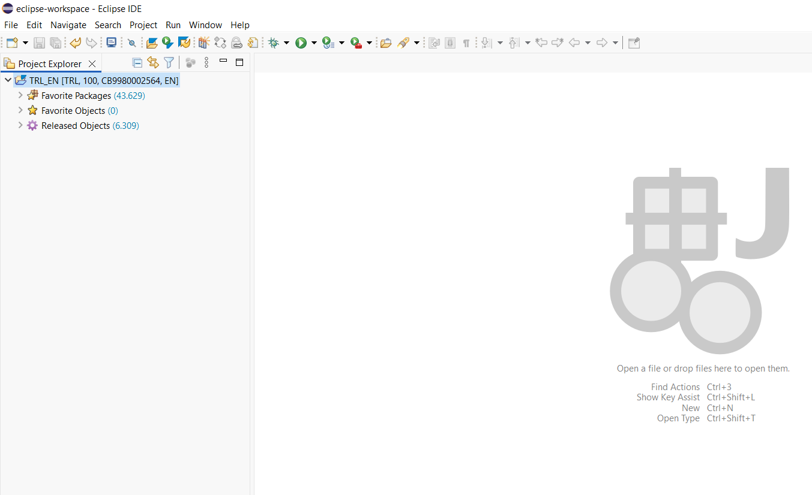
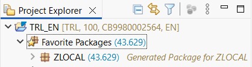
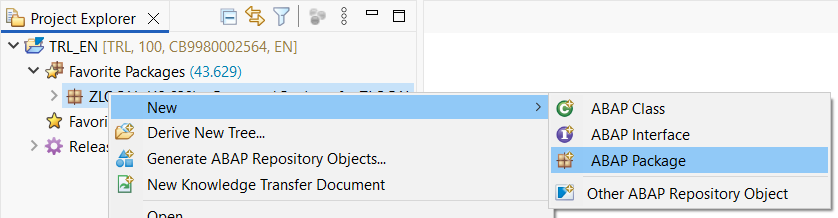
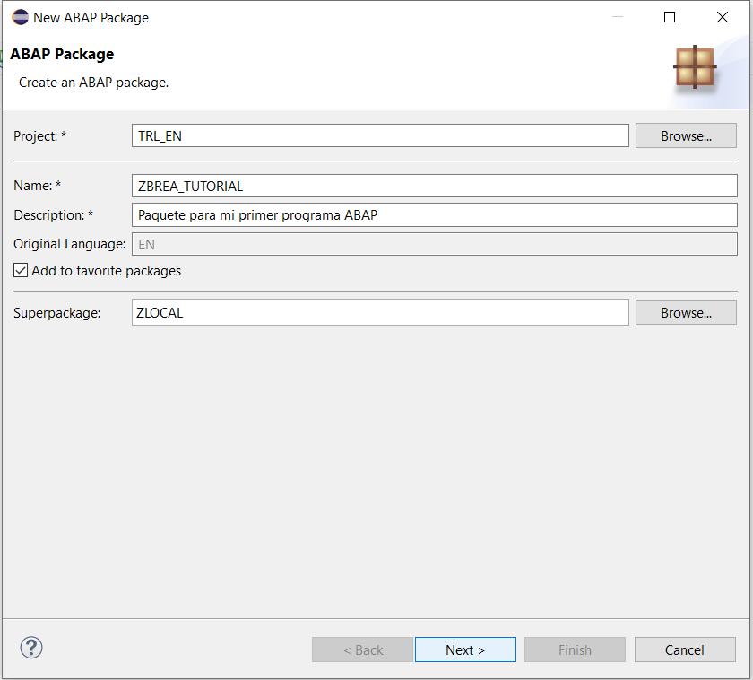
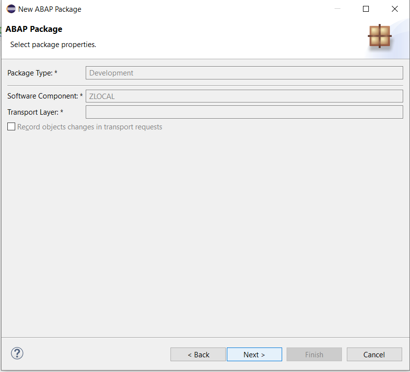
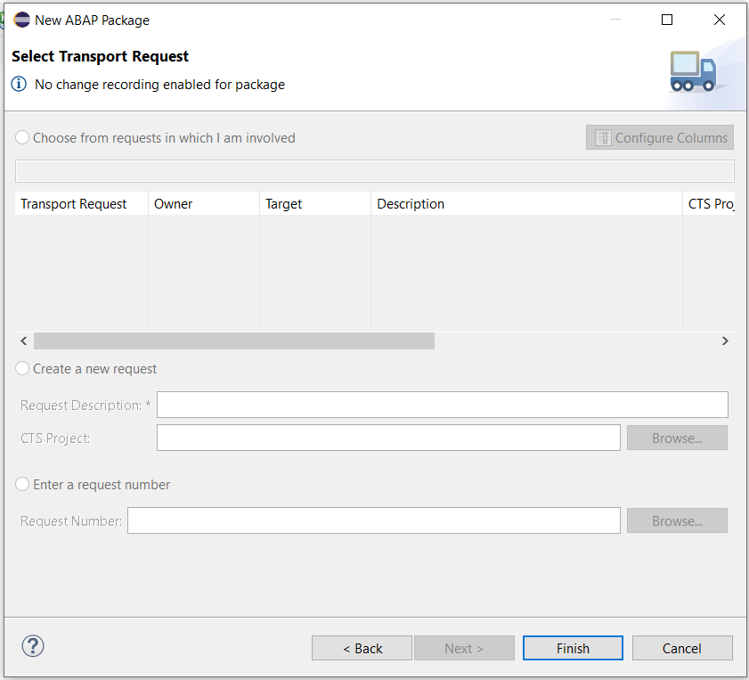
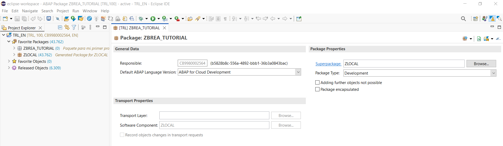

# 🚀 Capítulo 2: ¡Hola Mundo! Soy ABAP 🌍

| [⬅️ Ir al Capítulo 1](../docs/01-Introduccion.md) | [↩️ Volver al inicio del proyecto](../README.md) |
| :-----------------------------------------------: | :----------------------------------------------: |

---

En este capítulo vamos a dar nuestros primeros pasos reales en ABAP Cloud. Después de haber instalado Eclipse y conectado nuestro entorno en SAP BTP, ahora aprenderemos a entender el entorno de trabajo (el famoso Project Explorer) y crearemos nuestro primer programa ABAP: “¡Hola Mundo! Soy ABAP”.

---

## 🧭 Explorando Eclipse y el Project Explorer

Antes de programar nada, veamos qué tenemos en pantalla cuando abrimos nuestro entorno ABAP en Eclipse. Después de haber configurado todo en el Capítulo 1, ahora deberías ver algo así en el panel izquierdo 👇

- 🧩 **¿Qué es todo esto?**

Cuando conectas tu Eclipse con tu cuenta SAP BTP ABAP Cloud trial, SAP automáticamente crea una conexión al sistema TRL (Trial). No te preocupes, tú no creaste nada manualmente: esto viene preconfigurado para que puedas empezar a practicar sin tocar objetos del sistema.

| **Elemento**                            | **Qué es**                               | **Lo creaste tú** | **Para qué sirve**                                                     |
| :-------------------------------------- | :--------------------------------------- | :---------------: | :--------------------------------------------------------------------- |
| **TRL_EN [TRL, 100, CB9980002564, EN]** | Tu conexión activa a **ABAP Cloud**      |       ❌ No       | Es tu entorno Cloud, conectado con **SAP BTP**.                        |
| **Favorite Packages (42629)**           | Todos los **paquetes del sistema**       |       ❌ No       | Contiene el **código base estándar** de SAP.                           |
| **Favorite Objects (0)**                | Tu **lista personal de favoritos**       | ⚙️ Tú los añades  | Permite tener **acceso rápido** a tus programas y clases.              |
| **Released Objects (6309)**             | Objetos públicos **“liberados” por SAP** |       ❌ No       | Son las **APIs disponibles** que puedes usar libremente en ABAP Cloud. |

> 💡 Dato curioso: En ABAP Cloud solo puedes usar objetos liberados. Esto garantiza que todo tu código sea compatible con el entorno cloud y no dependa de funciones internas del sistema.

---

## 📦 Paquetes y estructura del entorno

En ABAP clásico (ECC), trabajábamos con transacciones como SE80 o SE38.
Pero en ABAP Cloud ya no existen esas transacciones — ahora todo se maneja como objetos dentro de Eclipse 🧱.

Los paquetes 📦 funcionan como carpetas organizadoras de tus programas, clases e interfaces.

Cuando recién comienzas, puedes crear tus desarrollos en el paquete temporal $TMP, que no requiere transporte ni autorización especial.

Más adelante aprenderemos a crear paquetes persistentes y transportables para proyectos reales.

---

## 📦 Crear tu propio paquete

1️⃣ En Eclipse, abre el panel izquierdo Project Explorer.

    Ahí verás tu conexión, algo como:

    TRL_EN [TRL, 100, tu numero id user trial, EN]

2️⃣ Expándelo (haz clic en el ▶️).

3️⃣ Dentro, abre la carpeta Favorite Packages.

Sobre ZLOCAL haz click derecho:
New → ABAP Package.

Te pedirá algunos datos:

**Name**: yo le voy a poner Z + mi primer apellido + \_TUTORIAL = ZBREA_TUTORIAL

**Description**: “Paquete para mi primer programa ABAP”.

Marcamos el checkbox de "add to favorite packages" Le damos a Next

**¿Por qué no puedes seleccionar Software Component ni Transport Layer?**

ABAP Cloud Trial no funciona igual que un sistema on-premise (ECC/S4).

Cuando creas un paquete en ZLOCAL: Eclipse ya sabe en qué Software Component vas a trabajar. Por eso, el campo de Software Component aparece en gris y no se puede cambiar.

Lo mismo pasa con Transport Layer:En Trial, no existen transportes reales. Eclipse muestra el campo, pero no se puede editar.

**Select Transport Request aparece en blanco**

En sistemas productivos, aquí seleccionarías un transport request existente o crearías uno nuevo. En ABAP Cloud Trial, no hay transport requests disponibles.

Esto es esperado: simplemente Eclipse te obliga a pasar por esta pantalla, pero puedes darle Finish directamente.

Finalmente ya tenemos el paquete creado, y listo para crear nuestros programas.

---

## 💻 Crear tu primer programa ABAP

(desarrollando ...)

---

| [⬅️ Ir al Capítulo 1](../docs/01-Introduccion.md) | [↩️ Volver al inicio del proyecto](../README.md) |
| :-----------------------------------------------: | :----------------------------------------------: |
