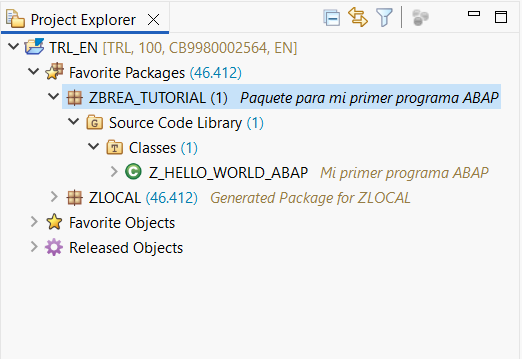
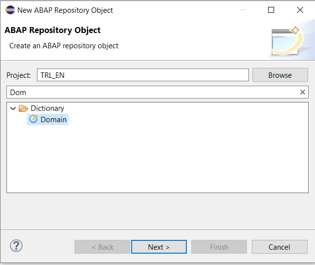
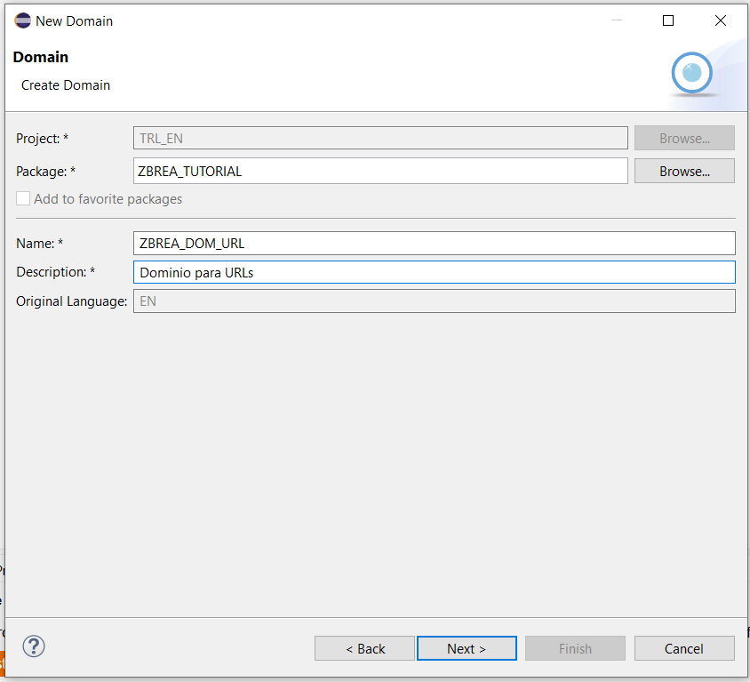
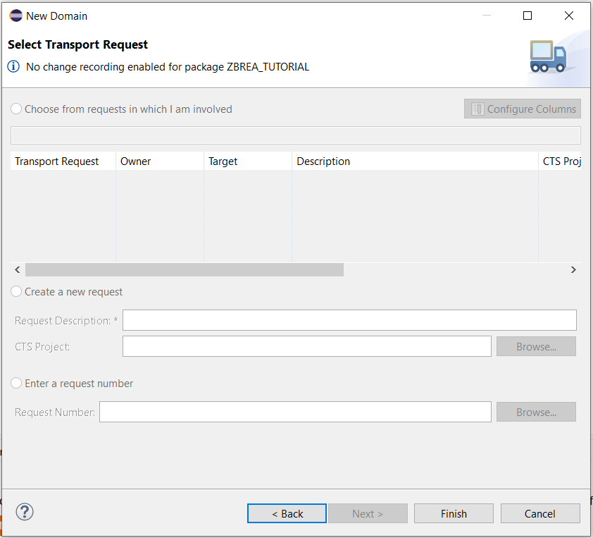
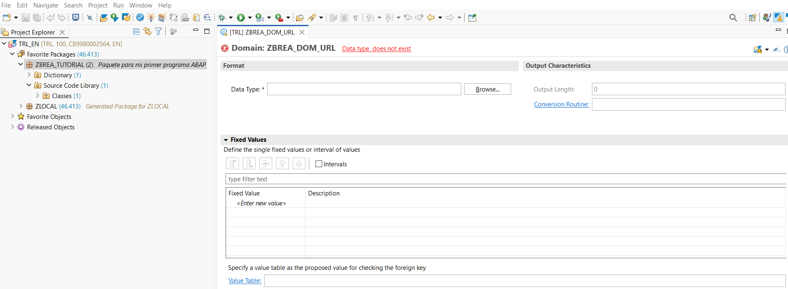

# 📘 Capítulo 3: Dominios y Elementos de Datos en SAP ABAP Cloud

| [⬅️ Ir al Capítulo 2](../docs/02-HolaMundoABAP.md) | [↩️ Volver al inicio del proyecto](../README.md) |
| :------------------------------------------------: | :----------------------------------------------: |

---

> En este capítulo aprenderás a crear **dominios** y **elementos de datos** en SAP ABAP Cloud desde Eclipse. Estos objetos son fundamentales dentro del **Diccionario de Datos** (Data Dictionary), ya que definen cómo se almacena y manipula la información en el sistema SAP Cloud.

---

## 📚 Índice del Capítulo

| Sección | Descripción |
| :------ | :---------- |

|
| [🧭 ¿Qué es el Diccionario de Datos?](#-qué-es-el-diccionario-de-datos) | Aprende qué papel cumple el Data Dictionary en ABAP Cloud y por qué es tan importante. |
| [🧩 Creación de un Dominio en Eclipse](#-creación-de-un-dominio-en-eclipse) | Paso a paso para crear un dominio que defina las propiedades técnicas de tus campos. |
| [⚙️ Configuración del Dominio (🛠️ desarrollando)](#️-configuración-del-dominio) | Explicación de los parámetros técnicos del dominio: tipo de dato, longitud y valores. |
|

---

## 🧭 ¿Qué es el Diccionario de Datos?

El **Data Dictionary** es el lugar donde SAP almacena todos los objetos relacionados con los datos:

🌐 **Dominios** → Definen las propiedades técnicas de los campos (tipo, longitud, formato, valores permitidos).

🧩 **Elementos de datos** → Definen el significado y las propiedades semánticas de un campo.

📊 **Tablas y vistas** → Estructuras donde se guardan los datos propiamente dichos.

💡 En resumen, los dominios definen la “forma” del dato, y los elementos de datos definen su “significado”.

---

## 🧩 Creación de un Dominio en Eclipse

Te muestro a continuación, como crear un dominio en tu proyecto ABAP SAP Cloud. Por ejemplo, yo voy a usar el paquete donde trabajamos el "Hola Mundo" del capitulo 2 (ZBREA_TUTORIAL)

Nos posicionamos con el cursor encima de nuestro paquete y hacemos click boton derecho y seleccionamos: New > Other ABAP Repository Object

Busca Domain 🔍 y haz Clic en Next

Escribe un nombre y una descripción, por ejmplo ZBREA_DOM_URL – Dominio para URLs "es muy recomendable que uses siempre tus iniciales Z(tus iniciales) para cuando tengas que buscar algo creado por ti, lo encuentres rápido, ya que estamos en el modo de prueba".

En ABAP Cloud (Eclipse, entorno BTP) los objetos no se transportan con órdenes de transporte clásicas como en los sistemas on-premise (SAP ECC o S/4HANA local).

👉 Es decir, las órdenes de transporte no existen en el modelo Cloud, ya que los objetos se guardan directamente en el paquete del software component o del namespace asignado a tu espacio de desarrollo.

Por eso sale vacio estos campos, solo haz clic en finalizar (finish)

Y listo ya tenemos el dominio creado a la espera de una configuración.

---

## ⚙️ Configuración del Dominio

[ 🛠️ desarrollando ...]

---

| [⬅️ Ir al Capítulo 2](../docs/02-HolaMundoABAP.md) | [⬆️ Ir al inicio del capítulo](#-capítulo-3-dominios-y-elementos-de-datos-en-sap-abap-cloud) | [↩️ Volver al inicio del proyecto](../README.md) |
| :------------------------------------------------: | :------------------------------------------------------------------------------------------: | :----------------------------------------------: |
