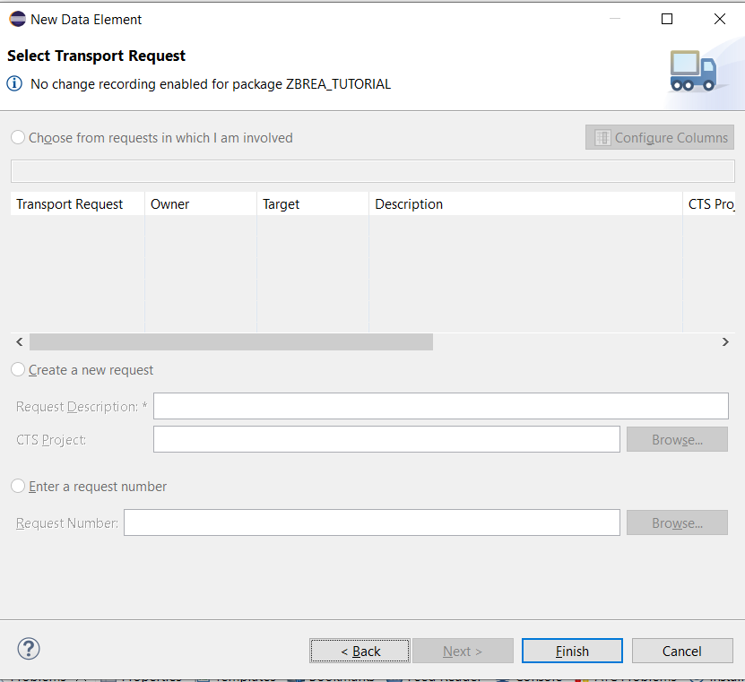
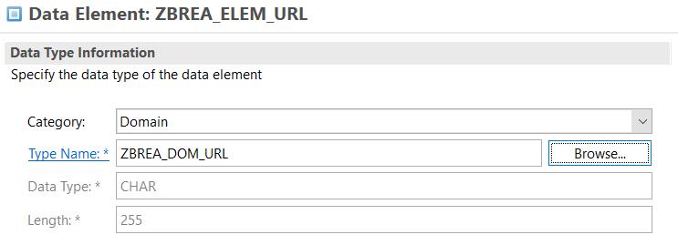
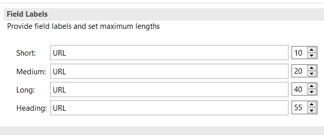
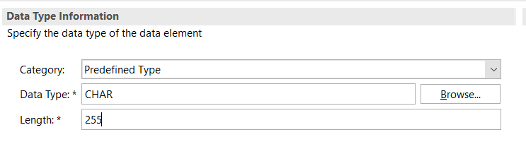
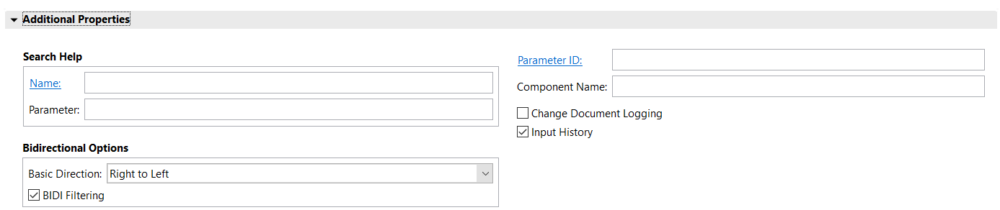

# 📘 Capítulo 3: Dominios y Elementos de Datos en SAP ABAP Cloud

| [⬅️ Ir al Capítulo 2](../docs/02-HolaMundoABAP.md) | [↩️ Volver al inicio del proyecto](../README.md) |
| :------------------------------------------------: | :----------------------------------------------: |

---

> En este capítulo aprenderás a crear **dominios** y **elementos de datos** en SAP ABAP Cloud desde Eclipse. Estos objetos son fundamentales dentro del **Diccionario de Datos** (Data Dictionary), ya que definen cómo se almacena y manipula la información en el sistema SAP Cloud.

---

## 📚 Índice del Capítulo

| Sección                                                                                                | Descripción                                                                            |
| :----------------------------------------------------------------------------------------------------- | :------------------------------------------------------------------------------------- |
| [🧭 ¿Qué es el Diccionario de Datos?](#-qué-es-el-diccionario-de-datos)                                | Aprende qué papel cumple el Data Dictionary en ABAP Cloud y por qué es tan importante. |
| [🧩 Creación de un Dominio en Eclipse](#-creación-de-un-dominio-en-eclipse)                            | Paso a paso para crear un dominio que defina las propiedades técnicas de tus campos.   |
| [⚙️ Configuración del Dominio](#️-configuración-del-dominio)                                           | Explicación de los parámetros técnicos del dominio: tipo de dato, longitud y valores.  |
| [🧱 Creación de un Elemento de Datos](#-creación-de-un-elemento-de-datos)                              | Aprende a crear un elemento de datos que use tu dominio o un tipo predefinido.         |
| [📐 Configurar un Elemento de Datos en ABAP Cloud](#-configurar-un-elemento-de-datos-en-abap-cloud)    | Configura las propiedades técnicas y semánticas de un elemento de datos paso a paso.   |
| [🎯 Diferencias Clave: Dominio vs Elemento de Datos](#-diferencias-clave-dominio-vs-elemento-de-datos) | Tabla resumida de las diferencias fundamentales entre dominios y elementos de datos.   |

---

## 🧭 ¿Qué es el Diccionario de Datos?

El **Data Dictionary** es el lugar donde SAP almacena todos los objetos relacionados con los datos:

🌐 **Dominios** → Definen las propiedades técnicas de los campos (tipo, longitud, formato, valores permitidos).

🧩 **Elementos de datos** → Definen el significado y las propiedades semánticas de un campo.

📊 **Tablas y vistas** → Estructuras donde se guardan los datos propiamente dichos.

💡 En resumen, los dominios definen la “forma” del dato, y los elementos de datos definen su “significado”.

---

## 🧩 Creación de un Dominio en Eclipse

Te muestro a continuación, como crear un dominio en tu proyecto ABAP SAP Cloud. Por ejemplo, yo voy a usar el paquete donde trabajamos el "Hola Mundo" del capitulo 2 (ZBREA_TUTORIAL)

👉 Nos posicionamos con el cursor encima de nuestro paquete y hacemos click boton derecho y seleccionamos: New > Other ABAP Repository Object

👉 Busca Domain 🔍 y haz Clic en Next

👉 Escribe un nombre y una descripción, por ejmplo ZBREA_DOM_URL – Dominio para URLs "es muy recomendable que uses siempre tus iniciales Z(tus iniciales) para cuando tengas que buscar algo creado por ti, lo encuentres rápido, ya que estamos en el modo de prueba".

👉 En ABAP Cloud (Eclipse, entorno BTP) los objetos no se transportan con órdenes de transporte clásicas como en los sistemas on-premise (SAP ECC o S/4HANA local). Es decir, las órdenes de transporte no existen en el modelo Cloud, ya que los objetos se guardan directamente en el paquete del software component o del namespace asignado a tu espacio de desarrollo.

Por eso sale vacio estos campos, solo haz clic en finalizar (finish)

👉Podemos ver en la raiz de nuestro proyecto, como se ha generado el dominio que acabamos de crear:

👉 Y listo ya tenemos el dominio creado a la espera de una configuración.

---

## ⚙️ Configuración del Dominio

> Es importante desde mi punto de vista, conocer bien, como se configura un dominio en ABAP SAP. Analizo campo por campo:

👇
| Propiedad | Descripción | Ejemplo práctico |
| :------------ | :----------------------------------------------------------------------------------------------------------- | :---------------------------------------------------------------------------------------------------------------------------- |
| **Data Type** | Tipo de dato físico en base de datos (ej. `CHAR`, `NUMC`, `DEC`, `INT`). Define cómo se guarda internamente. | `CHAR` para texto, `NUMC` para números almacenados como caracteres (p. ej. códigos), `DEC` para valores decimales monetarios. |

👇
| Propiedad | Descripción | Ejemplo práctico |
| :--------- | :------------------------------------------------------------------------------------------------ | :----------------------------------------------------------- |
| **Length** | Longitud máxima del campo (nº de caracteres o posiciones). Es el tamaño real en la base de datos. | `URL`: 255 &nbsp;&nbsp;•&nbsp;&nbsp; `Código país (NUMC)`: 3 |

👇
| Propiedad | Descripción | Ejemplo práctico |
| :---------------- | :----------------------------------------------------------------------------------------- | :------------------------------------------------------------------------------------ |
| **Output Length** | Longitud que se mostrará en pantallas o formularios. Puede ser menor o igual a **Length**. | Si `Length = 20` y `Output Length = 15`, solo se mostrarán 15 caracteres en pantalla. |

👇
| Propiedad | Descripción | Ejemplo práctico |
| :----------------- | :----------------------------------------------------------------------------------------------------------------- | :--------------------------------------------------------------------------------------------------------------- |
| **Decimal Places** | Número de decimales que almacena el campo; define la posición del punto decimal. Solo aplicable a campos tipo DEC. | Importe en euros: 2 decimales. Si `Length = 13` y `Decimals = 2`, acepta hasta 11 dígitos enteros + 2 decimales. |

👇
| Propiedad | Descripción | Ejemplo práctico |
| :----------------- | :------------------------------------------------------------------------------ | :------------------------------------------------------------------------------------------------------- |
| **Case Sensitive** | Indica si el campo distingue entre mayúsculas y minúsculas al comparar (A ≠ a). | URL: normalmente no sensible; códigos tipo AB12 pueden ser case-sensitive si se necesita diferenciarlos. |

👇
| Propiedad | Descripción | Ejemplo práctico |
| :--------------- | :----------------------------------------------------------------------------------- | :------------------------------------------------ |
| **Fixed Values** | Lista de valores permitidos; si se completa, solo se podrán introducir esos valores. | Estados: A = Activo, I = Inactivo, B = Bloqueado. |

👇
| Propiedad | Descripción | Ejemplo práctico |
| :---------------------------- | :------------------------------------------------------- | :------------------------------------------ |
| **Value Table / Check Table** | Referencia a una tabla para validar valores, si procede. | T005 (países) para validar códigos de país. |

👇
Nuestro ejemplo usaremos CHAR, con length 255, con output length 100, no case-sensitive

Para finalizar activamos nuestro dominio, haciendo clic en el icono (que parece una cerilla) o pulstamos ctrl + F3

---

## 🧱 Creación de un Elemento de Datos

> ⚠️ **Nota importante**: Los **dominios** no se usan directamente en programas, clases o tablas. Solo pueden ser utilizados a través de los **elementos de datos**.

👉 Por lo tanto, vamos a crear un elemento que use nuestro dominio ZBREA_DOM_URL. Vamos a nuestra raiz del proyecto.

👉 Podemos crear nuestro elemento de datos de la misma forma que hicimos al crear nuestro dominio: New > Other ABAP Repository Object y buscamos Data Element.

Pero tambien podemos crearlo haciando clic sobre la carpeta dictionary: new > data element

👉 Ponemos un nombre a nuesto data element, por ejemplo ZBREA_ELEM_URL y una descripción - Elemento para almacenar URLs. Y pulsumanos next.

👉 Las órdenes de transporte no existen en el modelo Cloud, lo dejamos vacio y le damos a finalizar.

👉 Listo, ya nos aparece el Data Element en nuestra carpeta Dictionary del proyecto.

👉 Solo falta configuarar nuestro Data Element

---

## 📐 Configurar un Elemento de Datos en ABAP Cloud

> Los **elementos de datos** son objetos que definen **características técnicas y semánticas** de un campo, variable o parámetro en ABAP Cloud. Pueden crearse a partir de un **dominio** o de un **tipo predefinido**. Vamos a verlo paso a paso.

### 🔹 Elemento de Datos Basado en un Dominio

👉 Cuando usamos un dominio, el elemento de datos hereda automáticamente las propiedades técnicas definidas allí (tipo de dato, longitud, decimales, etc.), lo que ayuda a mantener **consistencia y reutilización**.

En el campo **Domain**, escribe el nombre del dominio que creaste antes, en mi caso:  
 `ZBREA_DOM_URL` y veras como se cargan automáticamente sus propiedades.

👉 Define las propiedades **semánticas**: En mi caso de ejemplo lo escribo todo URL

👉 Activa el elemento de datos haciendo clic en **Activate** o pulsando ctrl + F3.

> 🧩 Este tipo de elemento **hereda las propiedades técnicas del dominio**, asegurando consistencia y facilidad de mantenimiento.

---

### 🔹 Elemento de Datos con Tipo Predefinido

> Tenemos otra forma, si prefieres un método más rápido o no necesitas un dominio, puedes definir directamente el tipo de dato en el elemento:

👉 Tenemos que seleccionar **Predefined Type** en lugar de Domain.

👉 Define el tipo de dato directamente: por ejemplo `CHAR` con longitud `255` para nuestra URL.

👉 Esto es igual que el otro método, agrega la descripción y otros textos semánticos si lo deseas. Para finalizar activa el elemento de datos con ctrl + F3 o pulsando al icono en forma de cerilla.

> 💡 Este método es más rápido, pero **no aprovecha la reutilización ni la consistencia** que ofrecen los dominios.

### 🔹 Diferencias Clave

| Característica              | Basado en Dominio | Tipo Predefinido |
| --------------------------- | ----------------- | ---------------- |
| Reutilización               | ✅ Sí             | ❌ No            |
| Consistencia                | ✅ Alta           | ⚠️ Limitada      |
| Tiempo de creación          | ⚠️ Mayor          | ✅ Más rápido    |
| Hereda propiedades técnicas | ✅ Sí             | ❌ No            |

👉 Anotar que ambos metodos tienen propiedades adicionales, que ahora mismo no nos hace falta aprender, pero es bueno que lo veas

Ahora sabes cómo crear elementos de datos en ABAP Cloud y cuándo conviene usar un dominio frente a un tipo predefinido.

> 💡 **Tip:** A diferencia de los dominios, los **Elementos de Datos** sí se pueden usar directamente en tus objetos ABAP Cloud, como **clases**, **tablas**, **vistas**, **variables** y **parámetros de métodos**. Esto los hace mucho más flexibles para tus desarrollos.

---

## 🎯 Diferencias Clave: Dominio vs Elemento de Datos

Antes de mostrar la comparación, es importante entender que tanto los **dominios** como los **elementos de datos** son piezas fundamentales del Diccionario de Datos en ABAP Cloud.

Mientras que los dominios se enfocan en la **definición técnica** de un campo, los elementos de datos agregan un **significado semántico** y permiten que esos campos sean utilizados directamente en tablas, clases y otros objetos del sistema.

La siguiente tabla resume las diferencias clave entre ambos:

| Característica               | Dominio 🌐 | Elemento de Datos 🧩 |
| ---------------------------- | ---------- | -------------------- |
| Define tipo técnico          | ✅         | ✅ (si usa dominio)  |
| Define significado semántico | ❌         | ✅                   |
| Se usa en tablas y clases    | ❌         | ✅                   |
| Tiene valores fijos          | ✅         | ❌ (solo los hereda) |

---

## Ejercicios Propuestos

( en desarrollo)

---

| [⬅️ Ir al Capítulo 2](../docs/02-HolaMundoABAP.md) | [⬆️ Ir al inicio del capítulo](#-capítulo-3-dominios-y-elementos-de-datos-en-sap-abap-cloud) | [↩️ Volver al inicio del proyecto](../README.md) |
| :------------------------------------------------: | :------------------------------------------------------------------------------------------: | :----------------------------------------------: |
