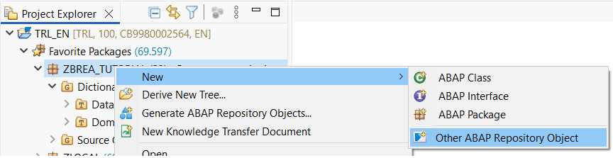
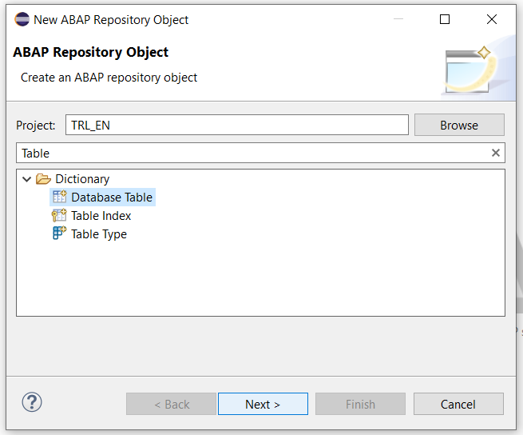
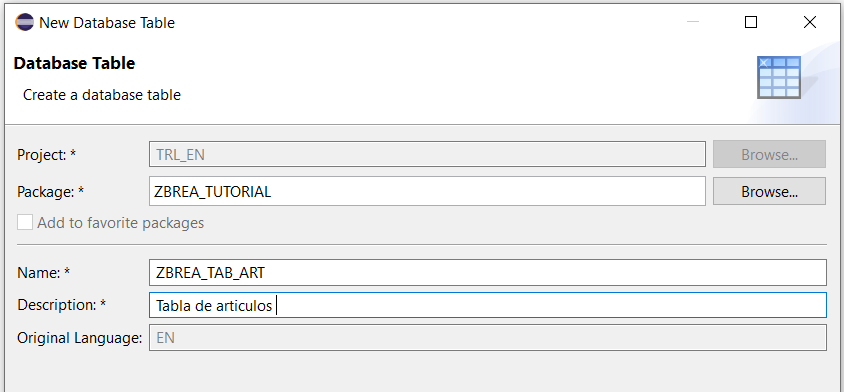
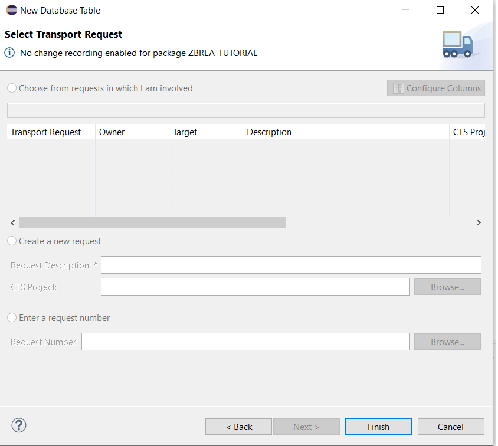
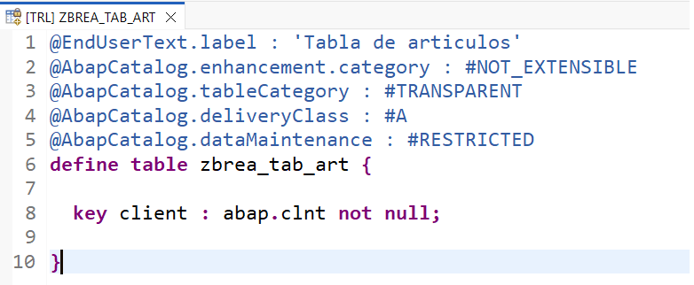
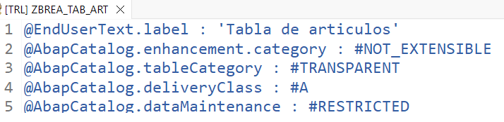
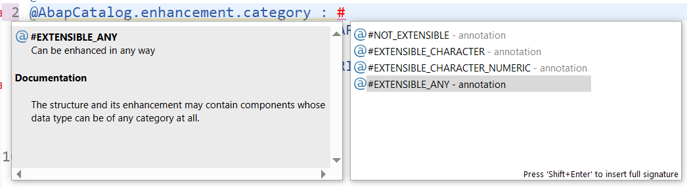
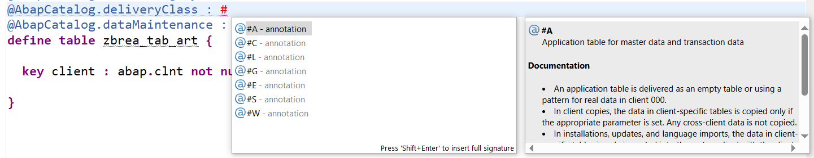
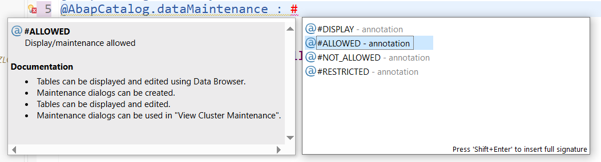
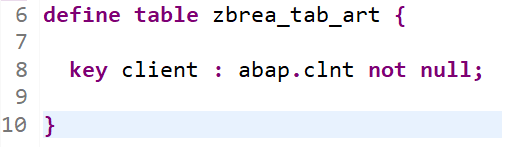

# 📘 Capítulo 4: Tablas en SAP ABAP Cloud

| [⬅️ Ir al Capítulo 3](../docs/03-DominioElemento.md) | [↩️ Volver al inicio del proyecto](../README.md) |
| :--------------------------------------------------: | :----------------------------------------------: |

 

 

> En este capítulo aprenderemos a crear nuestra primera tabla en ABAP Cloud en Eclipse, definir sus campos y luego agregarle datos reales para comenzar a construir la base de datos que usará nuestra futura aplicación web 🚀.

 

 

## 📚 Índice del Capítulo

| Sección                                                                                                | Descripción                                                                                       |
| :----------------------------------------------------------------------------------------------------- | :------------------------------------------------------------------------------------------------ |
| [1. 🧱 Creación de una tabla en ABAP Cloud](#1--creación-de-una-tabla-en-abap-cloud)                   | Paso a paso para crear una tabla en Eclipse usando ABAP Cloud desde cero.                         |
| [2. 🔍 Entendiendo el template inicial de una tabla](#2--entendiendo-el-template-inicial-de-una-tabla) | Explicación detallada de las anotaciones @... y la estructura base que se genera automáticamente. |

 

 

## [1. 🧱 Creación de una tabla en ABAP Cloud](#-índice-del-capítulo)

Para crear una tabla seguimos los siguientes pasos:

Clic derecho sobre tu package, en mi caso ZBREA_TUTORIAL.
New → Other ABAP Repository Object

 

 

En el buscador pon por ejemplo Table y seleccionas **Database Table** 📑 y le das a siguiente (next).

 

 

Pon un nombre (usa tus iniciales para que sea más fácil luego buscarlo). En mi caso voy a poner ZBREA_TAB_ART y descripcion pondré tabla de articulos.

 

 

El transporte 🚚 lo dejamos en blanco y pulsamos en finish.

 

 

Obtendremos un **template inicial** de nuestra tabla

 

 

 

## [2. 🔍 Entendiendo el template inicial de una tabla](#-índice-del-capítulo)

Cuando se crea la tabla verás varias anotaciones @... ✨.

 

 

Estas anotaciones definen cosas como:

- **@EndUserText.label 🏷️:** Esta anotación define la descripción legible de la tabla. Es básicamente el “nombre bonito” que verán los usuarios cuando naveguen los objetos. No afecta al funcionamiento, pero ayuda mucho a identificarla dentro del sistema.

- **@AbapCatalog.extensionCategory 🧩:** Aquí indicamos si nuestra tabla se puede ampliar o no, y de qué forma. Por ejemplo, podemos permitir extensiones libres, restringidas o no permitir ninguna. Esto es útil cuando otras personas o módulos podrían querer agregar campos sin modificar la tabla original.

Para ver las opciones y documentación de este tipo de anotación, escribimos # y a continuación pulsamos [Ctrl + space]. Nosotros seleccionaremos la opción #EXTENSIBLE_ANY

 

 

- **@AbapCatalog.tableCategory 🔍:** Esta anotación define el tipo de tabla que estamos creando. Para la mayoría de nuestras necesidades, será una tabla transparente. Significa que la tabla existe físicamente en la base de datos y su estructura coincide exactamente con la definición en el diccionario ABAP.

- **@AbapCatalog.deliveryClass🔁:** #A le está diciendo al sistema que esta es una tabla de negocio y que sus registros deben crearse directamente en el ambiente donde se use la aplicación.

Aquí si queremos ver las opciones igual que en la otra anotación escribimos # y a continuación [Ctrl+space]. Seleccionamos la opción A.

 

 

- **@AbapCatalog.dataMaintenance ⚙️:** Aquí se indica si la tabla permite mantenimiento (es decir, insertar, modificar o borrar datos) y bajo qué condiciones. Podemos permitir actualizaciones completas, solo lectura o incluso prohibir cualquier modificación. Esto controla cómo interactúa el sistema y las herramientas con los datos de la tabla.

Para ver las opciones que tiene esta anotación, escribes # y a continuación [Ctrl + space] y elegimos ALLOWED para poder permitir actualizar nuestra tabla

 

 

En la siguiente parte de nuestro template inicial, encontramos la definición de nuestra tabla y dentro de las llaves estarán los campos de la tabla.

 

 

 

[ ... desarrollando temario ]

 

 

| [⬅️ Ir al Capítulo 3](../docs/03-DominioElemento.md) | [⬆️ Ir al inicio del capítulo](#-capítulo-4-tablas-en-sap-abap-cloud) | [↩️ Volver al inicio del proyecto](../README.md) |
| :--------------------------------------------------: | :-------------------------------------------------------------------: | :----------------------------------------------: |
