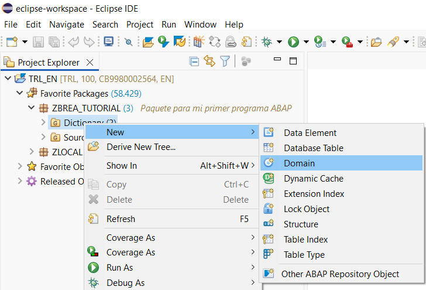
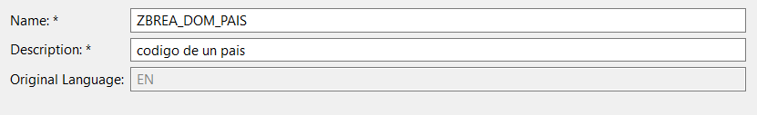
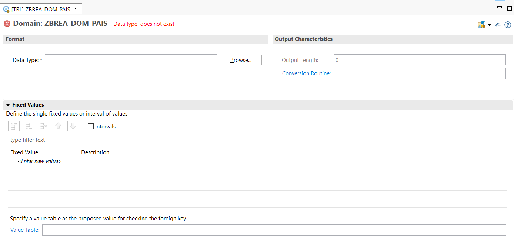
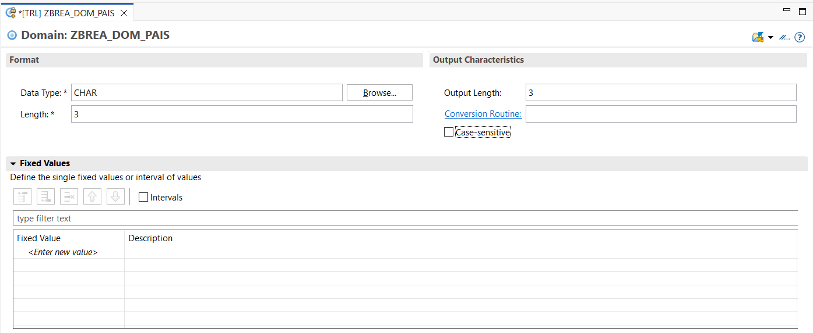
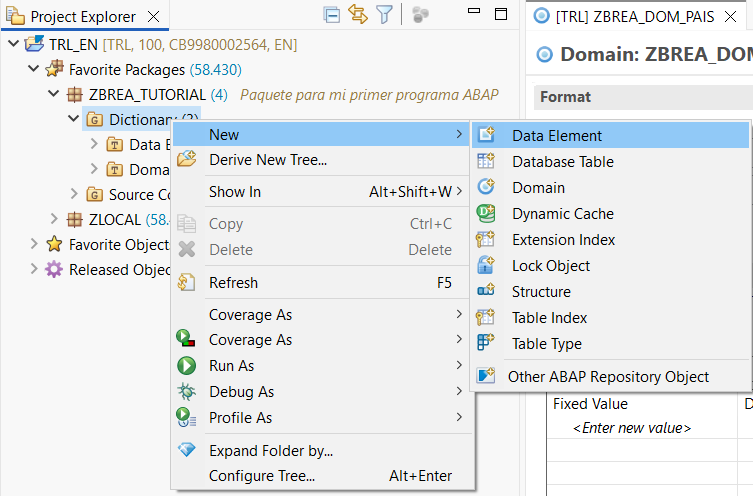
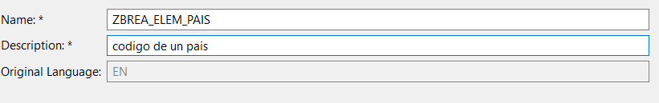
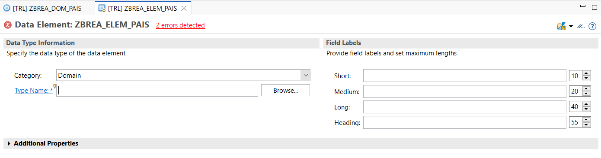
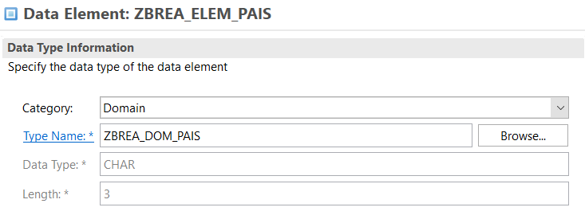
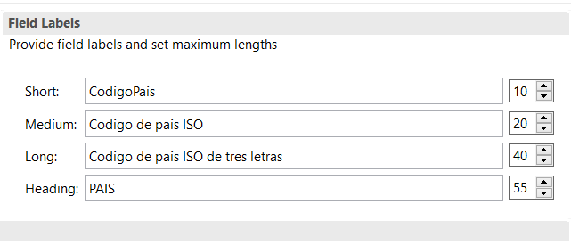

# Ejercicio 1: Crear un Dominio y un Elemento de Datos para almacenar un código de país

| [➡️ Ir al Ejercicio 2](../capitulo-03/ejercicio-02.md) | [↩️ Volver al inicio del Proyecto](../../README.md) | [↩️ Volver al Capítulo 3](../../docs/03-DominioElemento.md) |
| :----------------------------------------------------: | :-------------------------------------------------: | :---------------------------------------------------------: |

 
 

**🎯 Objetivo:** Aprender a crear un dominio simple y un elemento de datos que lo utilice.

**📘 Enunciado**: Crea un dominio llamado ZBREA_DOM_PAIS que almacene códigos de país de 3 caracteres. Luego, crea un elemento de datos llamado ZBREA_ELEM_PAIS que use este dominio.

**💡 Pistas**: - Usa tipo de dato CHAR con longitud 3. - No hace falta usar valores fijos. - El elemento de datos debe usar el dominio.

 
 

**Solución:** Para este ejercicio lo que tenemos que hacer es crear primero un dominio, que será el que defina las características técnicas del código de país, y luego un elemento de datos, que es lo que realmente utilizaremos en nuestros desarrollos.

1. **Crear el Dominio: ZBREA_DOM_PAIS**

Lo primero es crear un dominio que represente un código de país de 3 caracteres.
En Eclipse, nos posicionamos sobre la carpeta Dictionary → New → Domain

 

 

Relleno los campos de nombre: ZBREA_DOM_PAIS y descripcion: Codigo de un pais

 

 

Le damos a next, nos mostrará el Transport en blanco, dejalo tal cual dale a finish. Y listo tenemos nuestra plantilla de dominio para empezar a trabajar sobre ella.

 

 

Ahora rellenamos estos campos:

- Data Type: CHAR → porque es texto simple.
- Length: 3 → los códigos de país suelen ser de 2 o 3 letras, aquí usamos 3.
- Output Length: 3 → esto suele ser igual a la longitud del campo.
- Case Sensitive: No → así “ESP” y “esp” se consideran lo mismo.
- Fixed Values: Déjalo vacío → no estamos restringiendo valores, solo definiendo el tipo.

 

 

📌 Ok ya tenemos definido el “tipo técnico” del código de país.

2. **Crear el Elemento de Datos: ZBREA_ELEM_PAIS**

Ahora creamos el elemento de datos, que es lo que realmente usaríamos en tablas, clases, vistas, etc.

Nos vamos sobre la carpeta Dictionary → New → Data Element

 

 

Rellenamos los campos Nombre: ZBREA_ELEM_PAIS y en descripcion: codigo de un pais. Le damos next y dejamos el Transport vacio dandole finish.

 

 

Si todo salió correctamente, obtendremos la plantilla para rellenar un elemento de dato

 

 

Ahora seleccionamos Domain y en Type Name ponemos: ZBREA_DOM_PAIS → aquí le decimos que herede las propiedades del dominio que acabamos de crear.

 

 

En Short Description: CodigoPais
Medium/Long Description: Codigo de pais ISO de tres letras
Heading: PAIS → es el texto que verá un usuario en pantallas o formularios.

 

 

📌 Gracias a usar un dominio, no tenemos que volver a escribir el tipo CHAR(3). Se hereda automáticamente.

**Último paso**: Activar los objetos. Solo queda pulsar Activate ('icono en forma de cerilla' o usar Ctrl + F3) para activar tanto el dominio como el elemento de datos.

 

 

¡Y listo! Ya tienes un dominio simple y un elemento de datos completamente funcional para representar un código de país. Marivilloso, verdad 😊

 
 

| [⬆️ Ir al inicio del ejercicio](#ejercicio-1-crear-un-dominio-y-un-elemento-de-datos-para-almacenar-un-código-de-país) | [➡️ Ir al Ejercicio 2](../capitulo-03/ejercicio-02.md) | [↩️ Volver al inicio del Proyecto](../../README.md) | [↩️ Volver al Capítulo 3](../../docs/03-DominioElemento.md) |
| :--------------------------------------------------------------------------------------------------------------------: | :----------------------------------------------------: | :-------------------------------------------------: | :---------------------------------------------------------: |
