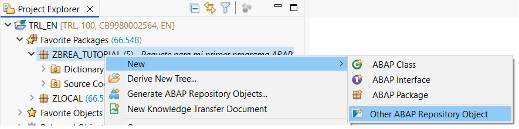
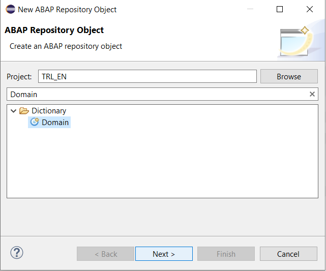
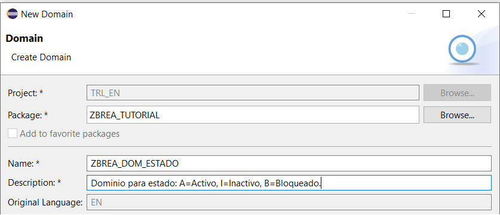
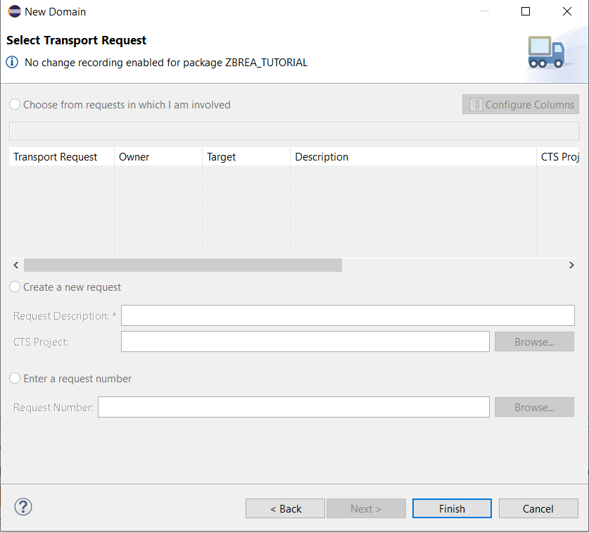
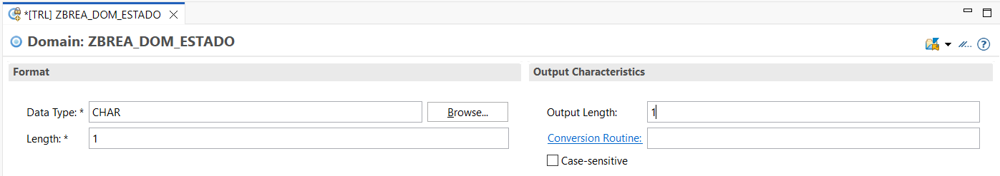
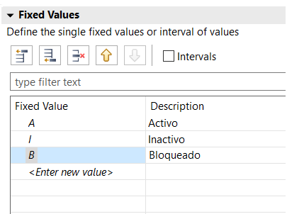
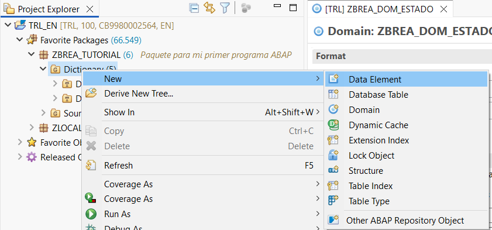
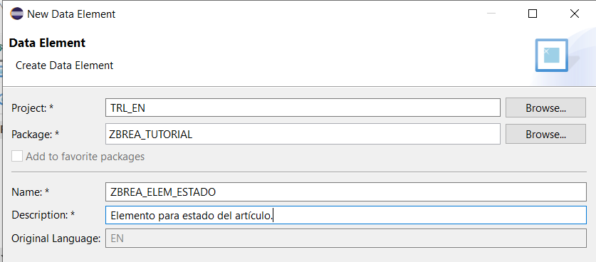
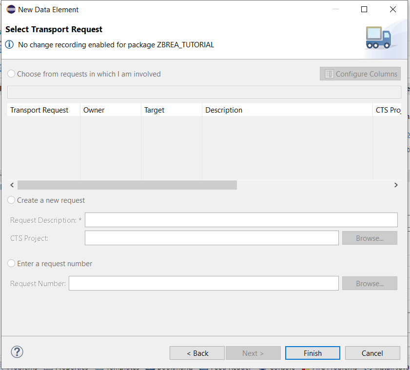

# Ejercicio 2: Crear un Dominio con valores fijos y un Elemento de Datos que los herede

| [⬅️ Ir al Ejercicio 1](../capitulo-03/ejercicio-01.md) | [↩️ Volver al inicio del Proyecto](../../README.md) | [↩️ Volver al Capítulo 3](../../docs/03-DominioElemento.md) |
| :----------------------------------------------------: | :-------------------------------------------------: | :---------------------------------------------------------: |

 
 

**🎯 Objetivo:** Aprender a usar valores fijos en un dominio y ver cómo los hereda un elemento de datos.

**📘 Enunciado:** Crea un dominio llamado ZBREA_DOM_ESTADO para almacenar un estado simple de un registro: A = Activo - I = Inactivo - B = Bloqueado. Luego crea un elemento de datos ZBREA_ELEM_ESTADO que utilice este dominio.

**💡 Pistas:** - Usa tipo CHAR(1) - Agrega los valores fijos en la sección Fixed Values - El elemento de datos los heredará automáticamente

 
 

**Solución:** En este ejercicio vamos a ver cómo crear un dominio con valores fijos y luego un elemento de datos que “hereda” esos valores. Esto sirve cuando quieres que un campo solo permita ciertos valores válidos, por ejemplo un estado: Activo, Inactivo o Bloqueado.

1. **Crear el Dominio: ZBREA_DOM_ESTADO**

Lo primero que hacemos es crear un dominio, que básicamente es un “molde” para tipos de datos. Aquí vamos a guardar los estados posibles.

En Eclipse, haz clic derecho sobre tu paquete → New → Other ABAP Repository Object.

 

 

Busca Domain → Next.

 

 

Ponle este nombre: ZBREA_DOM_ESTADO
En la descripción puedes poner algo como: Dominio para estado: A=Activo, I=Inactivo, B=Bloqueado.

 

 

El Transport Request dejalo en blanco y dale a Finish.

 

 

Y para la configuración del dominio, cuando se te abra el dominio pon lo siguiente:
Data Type: CHAR
Length: 1 - Esto significa que solo puede guardar un caracter (A, I o B).
Output Length: 1 - Muestra por pantalla el primer y único caracter que tenemos.

 

 

2. **Añadir los Valores Fijos**

Ahora vamos a indicar cuáles son los valores válidos para este dominio. Esto se hace en la pestaña Fixed Values.

| Value | Short Text |
| ----- | ---------- |
| A     | Activo     |
| I     | Inactivo   |
| B     | Bloqueado  |

Lo que estamos haciendo es decirle al sistema: “Oye, este tipo de datos solo puede tener A, I o B; nada más.”

 

 

Activar el dominio pulsando el botoncito de Activate (el de la cerillita) o usa Ctrl + F3.

 

 

3. **Crear el Elemento de Datos ZBREA_ELEM_ESTADO**

El siguiente paso es crear un elemento de datos, que básicamente es la forma “bonita” y “descriptiva” de usar el dominio.

Click derecho sobre Dictionary → New → Data Element.

 

 

Nombre: ZBREA_ELEM_ESTADO
Descripción: Elemento para estado del artículo.
Le damos a next.

 

 

El Transport Request lo debajamos en blanco y le damos a Finish.

 

 

🔗 Enlazamos el data elelent creado con el dominio: En el campo “Domain”, escribe ZBREA_DOM_ESTADO

Y listo, el elemento de datos ya tiene los tres valores fijos sin que tú tengas que volver a escribirlos.

También, rellena los textos
-Short: Estado
-Medium: Estado Registro
-Long: Estado del artículo (A=Activo, I=Inactivo, B=Bloqueado)
-Heading: Estado

 

 

Activar el dominio pulsando el botoncito de Activate (el de la cerillita) o usa Ctrl + F3.

 

 

✔️ **¿Qué conseguimos con esto?**

Ahora tenemos un elemento que podemos usar en tablas, estructuras, etc., y siempre va a tener los valores correctos.

Si en el futuro creamos una tabla como ZBREA_ARTICULOS, podríamos tener un campo llamado ESTADO que use este elemento de datos. Así solo se podrá poner A, I o B, evitando errores.

 
 

| [⬅️ Ir al Ejercicio 1](../capitulo-03/ejercicio-01.md) | [⬆️ Ir al inicio del ejercicio](#ejercicio-2-crear-un-dominio-con-valores-fijos-y-un-elemento-de-datos-que-los-herede) | [↩️ Volver al inicio del Proyecto](../../README.md) | [↩️ Volver al Capítulo 3](../../docs/03-DominioElemento.md) |
| :----------------------------------------------------: | :--------------------------------------------------------------------------------------------------------------------: | :-------------------------------------------------: | :---------------------------------------------------------: |
