# Ejercicio 3: Preparación para el Capítulo 4 (Tablas)

| [⬅️ Ir al Ejercicio 1](../capitulo-03/ejercicio-01.md) | [↩️ Volver al inicio del Proyecto](../../README.md) | [↩️ Volver al Capítulo 3](../../docs/03-DominioElemento.md) |
| :----------------------------------------------------: | :-------------------------------------------------: | :---------------------------------------------------------: |

 
 

**🎯 Objetivo:** Crear todos los dominios y elementos de datos para trabajar correctamente con el Data Dictionary antes de pasar a la definición de tablas en ABAP Cloud.

**📘 Enunciado:** Crea los dominios y elementos de datos necesarios para los siguientes campos que formarán parte de la tabla ZBREA_ARTICULOS en el próximo capitulo.

| Campo (futuro)       | Descripción funcional               | Tipo esperado           |
| -------------------- | ----------------------------------- | ----------------------- |
| ID_ARTICULO          | Identificador único del artículo    | Cadena alfanumérica     |
| NOMBRE_ARTICULO      | Nombre del artículo                 | Texto corto             |
| PRECIO_ARTICULO      | Precio base del artículo            | Decimal                 |
| DESCUENTO_ARTICULO   | Porcentaje de descuento             | Decimal con 2 decimales |
| PRECIOFINAL_ARTICULO | Precio final (precio – descuento)   | Decimal                 |
| DESCRIPCION_ARTICULO | Descripción visible para el cliente | Texto largo             |
| VALORACION_ARTICULO  | Valoración de 1 a 5                 | Número entero pequeño   |
| STOCK_ARTICULO       | Cantidad disponible en inventario   | Número entero           |

 

 

**Solución**: A continuación, te explico cada dominio y su elemento de datos, para que sepas exactamente qué poner. No vamos a entrar muy en detalle paso a paso como crear un dominio y un elemento de datos, porque es igual que hicimos en los ejercicios 1 y 2.

 

> 1️⃣ **ID_ARTICULO**

- Dominio: ZBREA_DOM_IDART
  - Tipo: CHAR
  - Longitud recomendada: 10
  - Case-sensitive: Sí

 

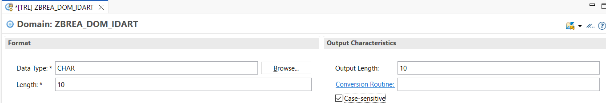

 

- Elemento de Datos: ZBREA_ELEM_IDART
  - Short Text: id
  - Medium Text: identificador
  - Long Text: identificador del articulo
  - Heading: id

 

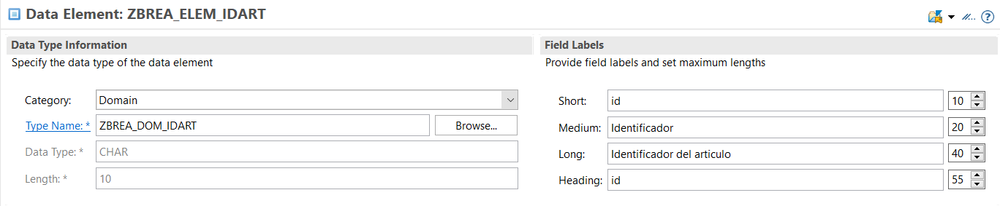

 

> 2️⃣ **NOMBRE_ARTICULO**

- Dominio: ZBREA_DOM_NOMART
  - Tipo: CHAR
  - Longitud: 40 (texto corto típico)

 

 

- Elemento de Datos: ZBREA_ELEM_NOMART
  - Short Text: nombre
  - Medium Text: nombre articulo
  - Long Text: nombre completo del articulo
  - Heading: nombre

 

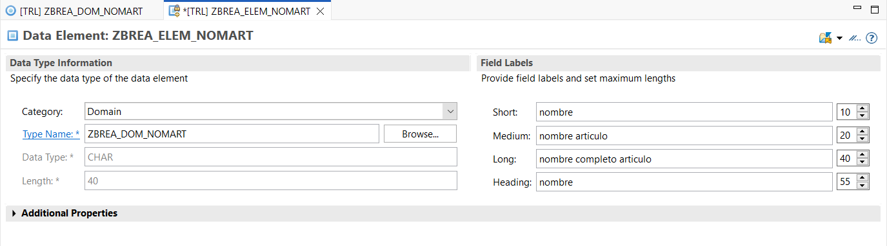

 

> 3️⃣ **PRECIO_ARTICULO**

- Dominio: ZBREA_DOM_PRECIOART
  - Tipo: DEC o CURR
  - Longitud: 11
  - Decimales: 2

(CURR es lo más típico para precios, pero DEC también sirve si no queremos usar moneda.)

 

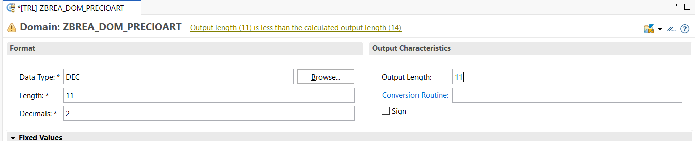

 

- Elemento de Datos: ZBREA_ELEM_PRECIOART
  - Short Text: precio
  - Medium Text: precio base
  - Long Text: Precio base sin aplicar descuentos.
  - Heading: precio

 

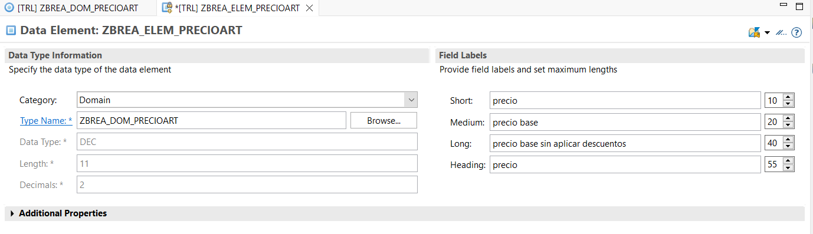

 

> 4️⃣**DESCUENTO_ARTICULO**

- Dominio: ZBREA_DOM_DESCUENTOART
  - Tipo: DEC
  - Longitud: 5
  - Decimales: 2

 

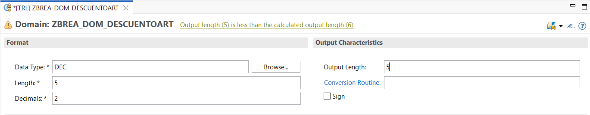

 

- Elemento de Datos: ZBREA_ELEM_DESCUENTOART
  - Short Text: % descuento
  - Medium Text: % descuento articulo
  - Long Text: % descuento articulo aplicado al precio
  - Heading: Descuento

 

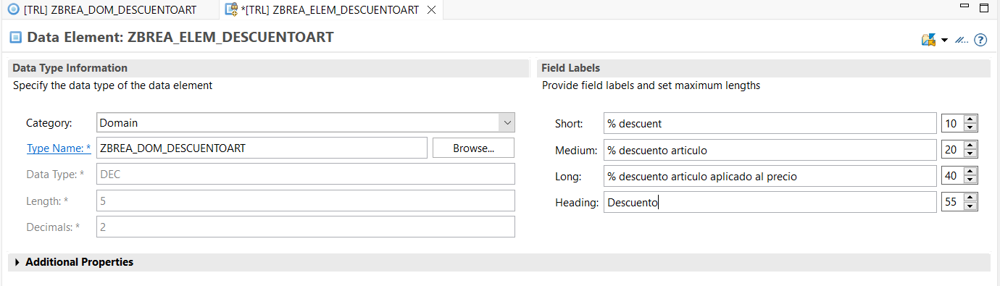

 

> 5️⃣ DESCRIPCION_ARTICULO

- Dominio: ZBREA_DOM_DESCRIPCIONART
  - Tipo: CHAR o STRING
  - Recomendado: CHAR 200 para descripción corta / CHAR 255 / STRING si es largo.

(Ojo: STRING solo se puede usar en tablas CDS o estructuras, pero no en tablas transparentes clásicas. En ABAP Cloud sí se puede.)

 

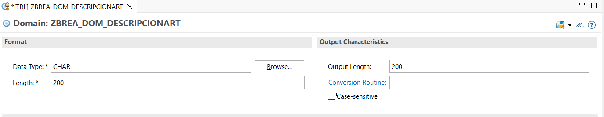

 

- Elemento de Datos: ZBREA_ELEM_DESCRIPCIONART
  - Short Text: descripcion
  - Medium Text: descripcion articulo
  - Long Text: descripcion detallada articulo
  - Heading: descripcion

 

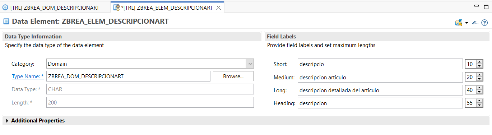

 

> 6️⃣ VALORACION_ARTICULO

- Dominio: ZBREA_DOM_VALORACIONART
  - Tipo: NUMC
  - Longitud: 1

Valores fijos posibles:

Value Short
1 Muy mala
2 Mala
3 Normal
4 Buena
5 Excelente

 

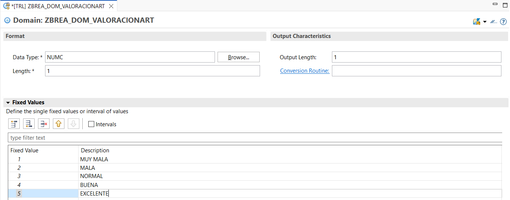

 

- Elemento de Datos: ZBREA_ELEM_VALORACIONART
  - Short Text: valoracion
  - Medium Text: valoracion articulo
  - Long Text: valoracion de 1 a 5 segun opinióm
  - Heading: rating

 

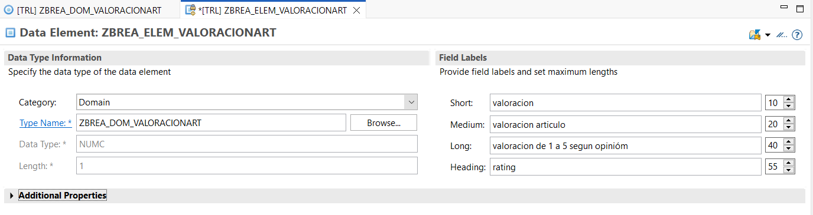

 

> 7️⃣ STOCK_ARTICULO

- Dominio: ZBREA_DOM_STOCKART
  - Tipo: INT2 o INT4
  - Recomendado: INT4

 

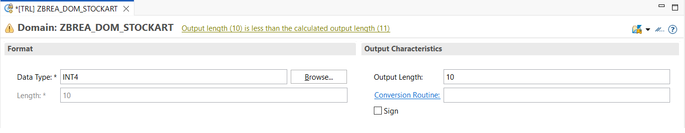

 

- Elemento de Datos: ZBREA_ELEM_STOCKART
  - Short Text: stock
  - Medium Text: stock articulo
  - Long Text: stock disponible del articulo
  - Heading: stock

 

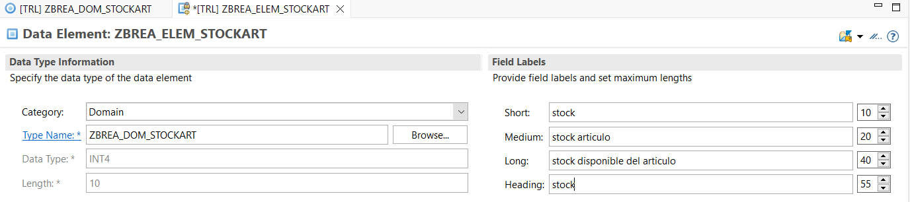

 

Y listo, ya tenemos todos los dominios y elementos creados para nuestra tabla en el capitulo 4.

 
 

| [⬅️ Ir al Ejercicio 2](../capitulo-03/ejercicio-02.md) | [⬆️ Ir al inicio del ejercicio](#ejercicio-3-preparación-para-el-capítulo-4-tablas) | [↩️ Volver al inicio del Proyecto](../../README.md) | [↩️ Volver al Capítulo 3](../../docs/03-DominioElemento.md) |
| :----------------------------------------------------: | :---------------------------------------------------------------------------------: | :-------------------------------------------------: | :---------------------------------------------------------: |
